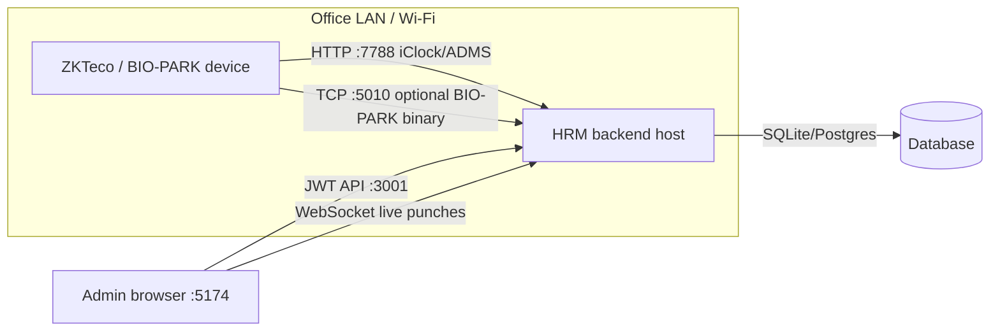

# Biometric Device Connection Plan

How physical attendance devices connect to Raintech HRM — network layout, registration, PIN mapping, and verification.

**Admin / IT setup guide:** [BIOMETRIC-DEVICE-SETUP.md](BIOMETRIC-DEVICE-SETUP.md)

---

## Architecture overview



| Component | Port | Protocol | Auth |
|-----------|------|----------|------|
| Tenant API | **3001** | HTTPS/HTTP | JWT |
| Biometric HTTP (iClock / ADMS) | **7788** | Plain HTTP | None (serial + registration) |
| BIO-PARK TCP (optional) | **5010** | Binary | None |
| Tenant UI | **5174** | HTTP (dev) | Browser session |

**Important:** Devices speak **plain HTTP on 7788**, not the main API port 3001. The backend starts both listeners when you run `cargo run`.

---

## Prerequisites

1. **Backend running** with `HOST=0.0.0.0` (listen on all interfaces).
2. **`.env`** (see `backend/.env.example`):
   - `BIOMETRIC_PORT=7788`
   - `BIO_PARK_TCP_PORT=5010` (only if using BIO-PARK TCP)
   - Optional: `BIOMETRIC_STRICT_IP=1` (reject punches from IPs that don’t match registered device IP)
3. **Firewall** — allow inbound **7788** (and **5010** if used) from the device subnet only.
4. **Same network** — device and server must be on the same LAN (e.g. `172.16.1.x`). Devices cannot reach `localhost` on your PC.

---

## Connection plan (step by step)

### Phase 1 — Server & network

| Step | Action | Verify |
|------|--------|--------|
| 1.1 | Start backend: `cd backend && cargo run` | `http://127.0.0.1:3001/api/health` → 200 |
| 1.2 | Confirm biometric port | `http://<server-ip>:7788/iclock/cdata?SN=probe&options=all` → 200 |
| 1.3 | Find server LAN IP | `ipconfig` (Windows) — note IPv4, e.g. `172.16.1.50` |
| 1.4 | Open firewall for 7788 from office subnet | Ping device ↔ server |

### Phase 2 — Register device in HRM

| Step | Action | Verify |
|------|--------|--------|
| 2.1 | Log in to tenant UI → **Admin → Biometric** | Page loads |
| 2.2 | On physical device: **Menu → System → Device Info** | Note **Serial Number** (e.g. `A250902070`) |
| 2.3 | Click **Register Device** — enter SN **exactly** as on device | Row appears in Devices tab |
| 2.4 | Set name / location (optional) | Saved in `biometric_devices` |

Unregistered serials: handshake returns `OK` but **no punches are stored**.

### Phase 3 — Configure device server settings

On the device (**Menu → Communication / Server** — labels vary by model):

| Field | Value |
|-------|--------|
| Server IP | Your PC/server **LAN IP** (not `127.0.0.1`) |
| Server port | **7788** |
| Protocol | ADMS / iClock (HTTP) |
| HTTPS | **Off** (devices typically cannot use TLS) |
| Upload interval | 1–10 minutes (default OK) |

Save settings and **reboot the device**.

### Phase 4 — Confirm online status

| Step | Action | Expected |
|------|--------|----------|
| 4.1 | Wait 1–5 minutes after reboot | Device polls `GET /iclock/cdata` |
| 4.2 | Check **Devices** tab in HRM | Green dot = online |
| 4.3 | Check **IP address** on device row | Updates to device’s LAN IP |
| 4.4 | Check backend logs | `Handshake from device SN=...` |

Device heartbeat flow:

```
Device boot
  → GET /iclock/cdata?SN=<serial>&options=all
  → HRM validates SN in biometric_devices
  → Returns iClock option block (Delay, TransFlag, Realtime=1)
  → Updates last_heartbeat, ip_address, is_active=1
```

### Phase 5 — Enroll employees & map PINs

| Step | Action | Verify |
|------|--------|--------|
| 5.1 | On device: enroll fingerprint/face/card per employee | Each user gets a **PIN** (e.g. `1001`) |
| 5.2 | In HRM: **Map PIN** → select device, enter PIN, select employee | Mapping saved |
| 5.3 | Employee punches on device | Punch appears in **Punch log** (live via WebSocket) |
| 5.4 | Mapped punch | Creates/updates **attendance** for that user |

Mapping table: `biometric_user_map` (device_serial + device_pin → user_id).

### Phase 6 — Production hardening (optional)

| Setting | Purpose |
|---------|---------|
| `BIOMETRIC_STRICT_IP=1` | Only accept ATTLOG from IP matching registered device IP |
| Firewall | Restrict 7788/5010 to office VLAN |
| One SN per org | SaaS isolation — each tenant only sees their devices |
| Remove test devices | Delete rows with wrong SN (e.g. `unknown`) |

---

## Data flow (punch → attendance)

```
Employee scans finger
  → Device buffers ATTLOG locally
  → POST /iclock/cdata?SN=<serial>&table=ATTLOG
       Body: PIN\tTimestamp\tStatus\tVerify\t...
  → HRM: SN registered? IP allowed? PIN mapped?
  → INSERT biometric_punches
  → Apply to attendance (clock-in/out rules)
  → WebSocket event → Admin UI live feed
```

Device also polls:

- `GET /iclock/getrequest` — receive pending commands from `biometric_commands` queue
- `POST /iclock/devicecmd` — command execution results

---

## Supported device types

| Type | Protocol | Port | Notes |
|------|----------|------|-------|
| ZKTeco iClock | HTTP `/iclock/*` | 7788 | Most common; tested in QA suite |
| BIO-PARK ADMS | HTTP `/pub/chat`, `/pub/getrequest` | 7788 | WebSocket + POST variant |
| BIO-PARK TCP | Binary listener | 5010 | Alternative transport |

---

## Troubleshooting

| Symptom | Likely cause | Fix |
|---------|--------------|-----|
| Device offline | Wrong IP or port | Use LAN IP + port **7788**, not 3001 |
| Handshake OK, no punches | SN not registered or typo | Re-register exact SN from device menu |
| Punches in log, no attendance | PIN not mapped | Add mapping in **Map PIN** |
| Punches ignored | `BIOMETRIC_STRICT_IP=1` + IP mismatch | Update device IP or disable strict mode in dev |
| Works on PC, fails on LAN | Firewall / `HOST=127.0.0.1` | Set `HOST=0.0.0.0`, open firewall |
| Duplicate / ghost devices | Old test registrations | Delete unused rows in Devices tab |

---

## QA verification

Automated checks: `python scripts/test-biometric-suite.py` (22 cases)

- iClock handshake on `:7788`
- ATTLOG ingest for registered SN `A250902070`
- PIN mapping → attendance
- Tenant isolation (org2 cannot see org1 device)

Full marathon includes this suite: `scripts/run-complete-all-tests.ps1`.

---

## Quick reference (your dev setup)

| Item | Value |
|------|--------|
| Test device SN | `A250902070` |
| Biometric URL | `http://<your-lan-ip>:7788` |
| Admin UI | `http://localhost:5174/admin/biometric` |
| Register before connect | Yes — SN must exist in HRM first |
