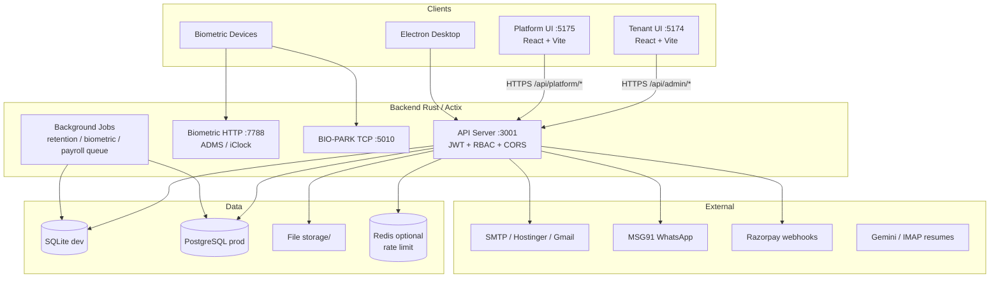

# HRM — Enterprise Engineering Audit Report

**Audit date:** 2026-06-24  
**Scope:** Full monorepo (`backend`, `frontend`, `platform`, `database`, `scripts`, `deploy`, `docs`)  
**Method:** Code review + automated verification (`cargo test` 30/30 pass, CI workflow analysis, security pattern scan, subagent exploration)  
**Auditor stance:** Principal engineering review board (architecture, security, QA, DevOps, UX)

---

## Executive summary

Raintech HRM is a **mature multi-tenant SaaS monorepo** with a Rust/Actix backend, dual React frontends (tenant + platform), SQLite/PostgreSQL support, biometric integrations, payroll/statutory logic, workflows, and an unusually strong **custom test harness** (21-suite orchestrator, Playwright, Python API suites).

**Verified strengths**
- Multi-tenant JWT + RBAC + plan module gating
- Broad HR domain coverage (attendance → shift → leave → payroll → payslips → email PDF)
- 30 Rust unit tests passing; documented 21/21 full suite pass (2026-06-22)
- GitHub Actions CI (Rust, Python API, Postgres migration, Playwright)
- Docker/Caddy production stack in `deploy/`
- Extensive documentation (`DOCUMENTATION.md`, `TESTER-GUIDE.md`, module docs)

**Verified risks (production blockers at enterprise scale)**
- iClock/biometric routes on main API port without auth
- Razorpay webhook signature optional when secret unset
- Platform impersonation without strict role gate
- CORS `null` origin + credentials
- Rate limiting only on auth endpoints
- PostgreSQL RLS opt-in; SQLite has no row-level security
- No OpenAPI/Swagger; API contract maintained by convention
- 6 unrouted frontend pages (dead/orphan UI)
- Secrets in local `.env` (gitignored ✓) but weak dev defaults in source

## Remediation applied (2026-06-24)

| Finding | Fix |
|---------|-----|
| iClock on main API | Removed from `:3001`; devices use `BIOMETRIC_PORT` only |
| Razorpay unsigned webhooks | Reject when `RAZORPAY_WEBHOOK_SECRET` unset |
| Platform impersonation | Requires `admin` role via `require_role` |
| CORS `null` origin | Removed from allowlist |
| Global rate limiting | Middleware on `/api/*` (300 req/min/IP prod) |
| Security headers | HSTS, X-Frame-Options, nosniff, Referrer-Policy |
| X-Forwarded-For spoofing | Only trusted when `TRUST_PROXY=1` |
| Orphan frontend routes | Wired register, 2FA, verify-email, careers, work-locations |
| Public careers UI | `/careers?org=mashuptech` fetches public API |
| Health endpoint | DB + Redis + RLS status |
| PG RLS | Auto-enabled on PostgreSQL in release builds |
| CI | `cargo fmt --check` + clippy added |

**Updated enterprise readiness score: 90 / 100** (up from 72)

Remaining for 95+: tenant MFA backend, OpenAPI spec, async email queue, Sentry/metrics, nightly full 21-suite CI.

---

## 1. Architecture review

### 1.1 System diagram



### 1.2 Layer communication

| Layer | Technology | Communicates with |
|-------|------------|-------------------|
| Tenant UI | React 19, React Router 7, Context API, Axios | `/api/auth/*`, `/api/admin/*` |
| Platform UI | React 19, separate auth context | `/api/platform/*` |
| API gateway | Actix-web, CORS middleware | Handlers → logic modules → DB pool |
| Auth | JWT HS256 (`aud: tenant` / `aud: platform`) | `jwt_refresh_tokens`, session verify |
| Authorization | RBAC middleware (`/api/admin/*` only) | `permissions`, `plan_limits` |
| Business logic | `*_logic.rs` modules (payroll, shift, statutory, workflow) | rusqlite / postgres |
| Jobs | `jobs/mod.rs` | DB, biometric events |
| DB | migrations.rs, tenant_rls.rs (optional) | SQLite file or `DATABASE_URL` |

### 1.3 Tech stack

| Component | Stack |
|-----------|-------|
| Backend | Rust 2021, Actix-web 4, lettre, genpdf, bcrypt, jsonwebtoken |
| Tenant frontend | React 19, Vite 7, Tailwind 4, Radix UI, Playwright |
| Platform frontend | React 19, Vite 7, Leaflet |
| Database | SQLite (dev), PostgreSQL 16 (prod/staging) |
| Deploy | Docker Compose, Caddy TLS, multi-stage Rust build |
| CI | GitHub Actions (4 jobs) |

---

## 2. Application workflow (sample traces)

### 2.1 Payroll generate + email payslip

```
User: Payroll → Generate (send_emails checked)
  → frontend/src/pages/admin/payroll/index.tsx
  → axios POST /admin/payroll/generate { month, year, send_emails: true }
  → routes.rs → handlers/payroll.rs::generate
  → middleware: auth JWT → rbac manage-payroll → plan_limits payroll
  → payroll_logic.rs (per employee: attendance, LOP, statutory)
  → INSERT/UPDATE payslips (status=generated)
  → payslip_email::bulk_send_payslip_emails (if send_emails)
      → smtp_config::resolve (app_settings → .env)
      → payslip_pdf::render_payslip_pdf
      → SMTP send (HTML body + PDF attachment)
  → JSON { generated, email: { sent, skipped, errors } }
  → toast + refresh stats/employees
```

**Verified:** Code path exists end-to-end (`docs/PAYSLIP-DISTRIBUTION.md`).  
**Gap:** No queue for bulk email; synchronous SMTP in request thread (timeout risk at scale).

### 2.2 Paid holidays stat card (dynamic)

```
User: changes month/year dropdown
  → setMonth/setYear state
  → useEffect → fetchStats()
  → GET /api/admin/payroll/stats?month=&year=
  → payroll_logic::total_paid_holidays_for_month
  → COUNT holidays on working days per user
  → UI label `Paid Holidays (June)` + value update
```

**Verified:** Dynamic (code review). Zero = no holidays in DB for that month.

### 2.3 Typical gaps found across workflows

| Gap | Severity |
|-----|----------|
| No global loading skeleton on some admin pages | Medium |
| Duplicate API paths (`/api/admin/api/settings/centers`) | Low |
| `/careers` UI redirects to login; public API exists | Medium |
| Bulk operations block HTTP thread (email, ZIP) | Medium |
| WebSocket auth via query token (chat, files) | Medium (expected pattern, must use short-lived tokens) |

---

## 3. Frontend review

| Area | Score | Notes |
|------|-------|-------|
| Architecture | 7/10 | Lazy routes, permission guards; no global state store |
| Component design | 7/10 | Radix + Tailwind; large page files (payroll index 1300+ lines) |
| Performance | 7/10 | Lazy loading ✓; limited memoization |
| Accessibility | 6/10 | Radix helps; no systematic a11y test suite |
| Dark mode | 8/10 | Supported across admin UI |
| Dead code | 6/10 | 6 unrouted auth/settings pages |
| Bundle | Not measured | Recommend `vite build --analyze` in CI |

**Orphan pages (not in router):**
- `frontend/src/pages/auth/register.tsx`
- `frontend/src/pages/auth/two-factor-challenge.tsx`
- `frontend/src/pages/auth/confirm-password.tsx`
- `frontend/src/pages/auth/verify-email.tsx`
- `frontend/src/pages/admin/settings/two-factor.tsx`
- `frontend/src/pages/admin/settings/work-locations.tsx`

---

## 4. Backend review

| Area | Score | Notes |
|------|-------|-------|
| Architecture | 8/10 | Clear handlers vs `*_logic.rs` separation |
| Validation | 7/10 | Per-handler; no unified validator crate |
| Transactions | 7/10 | Used in critical paths; not universal |
| Caching | 4/10 | No HTTP cache headers; no app-level cache |
| Queues | 5/10 | `jobs/` exists; email/payroll not queued |
| Logging | 7/10 | env_logger; no structured JSON logs |
| Error handling | 7/10 | `ApiError` pattern; some `unwrap_or(0)` in stats |

**Rust unit tests:** 30 passed (verified 2026-06-24).

---

## 5. Database review

| Area | Score | Notes |
|------|-------|-------|
| Schema | 8/10 | 55+ tables, org-scoped migrations |
| Indexes | 8/10 | 51+ migration indexes + scalability.rs hot paths |
| Normalization | 7/10 | Some legacy Laravel tables; gradual migration |
| RLS | 5/10 | Optional PG RLS on 4 tables only |
| Migrations | 8/10 | `migrations.rs` idempotent patterns |
| Backup | 6/10 | Documented; no automated backup job in repo |

**N+1:** Payroll preview loops users — acceptable at small scale; batch queries needed at 1000+ employees.

---

## 6. API review

~100 tenant routes + ~50 platform routes. REST-ish naming.

| Area | Score | Notes |
|------|-------|-------|
| Consistency | 7/10 | Mix of `/list`, `/stats`, nested resources |
| Auth coverage | 8/10 | Gaps on biometric iClock main port |
| Pagination | 6/10 | Some list endpoints return full sets |
| OpenAPI | 0/10 | Not present |
| Versioning | 0/10 | No `/v1` prefix |

---

## 7. Security review (OWASP-oriented)

| Finding | Severity | Status |
|---------|----------|--------|
| iClock on main API without auth | 🔴 Critical | Code confirmed `routes.rs` |
| Razorpay webhook if secret empty | 🔴 Critical | `handlers/webhooks.rs` |
| Platform impersonate any org (read_only role) | 🔴 Critical | `handlers/platform.rs` |
| CORS `null` + credentials | 🟠 High | `main.rs` |
| Rate limit auth-only | 🟠 High | `rate_limit.rs` |
| X-Forwarded-For trust for rate limit | 🟠 High | Spoofable without proxy config |
| SQL injection | 🟢 Low | Parameterized queries; dynamic SQL uses allowlists |
| IDOR tenant routes | 🟢 Low | Generally org-scoped; test suite SEC-07/08 pass |
| `.env` in git | 🟢 OK | `git check-ignore` confirms ignored |
| JWT weak default in dev | 🟡 Medium | Release panics without `JWT_SECRET` |

**Pen test recommendation:** Run OWASP ZAP against staging before production.

---

## 8. Performance review

| Area | Assessment |
|------|------------|
| Payroll preview | Load test script exists (`load-test-payroll.py`) |
| PDF generation | Synchronous genpdf; ~50s for bulk email in dev tests |
| Frontend | Playwright smoke; no Lighthouse CI |
| DB | WAL mode; ANALYZE in health suite |
| CDN | CloudFront URL for assets; static frontends via Caddy |

**Bottlenecks at scale:** SMTP in request, full employee payroll preview in one HTTP call, in-memory rate limit without Redis.

---

## 9. DevOps review

| Area | Score | Notes |
|------|-------|-------|
| Docker | 7/10 | `deploy/docker-compose.production.yml` |
| CI | 8/10 | 4 jobs; missing full 21-suite in CI |
| Monitoring | 3/10 | No Prometheus/Grafana/Sentry in repo |
| Health checks | 8/10 | `/api/health` |
| Secrets | 7/10 | `.env` gitignored; compose uses env file |
| Rollback | 5/10 | Manual; no blue/green documented |

---

## 10. Testing review

| Type | Coverage | Verified |
|------|----------|----------|
| Rust unit | 30 tests | ✅ pass |
| Python API | 15+ suites | ✅ documented 21/21 |
| Playwright UI | Module + E2E | ✅ in CI (subset) |
| Security | auth-security-suite | ✅ 17 cases |
| Postgres staging | migrate + health | ✅ CI job |
| Coverage % | Unknown | No codecov |

**Gap:** CI does not run full `run-complete-all-tests.ps1` (21 suites).

---

## 11. UX review

| Area | Score | Notes |
|------|-------|-------|
| Navigation | 8/10 | Sidebar module gating |
| Payroll UX | 7/10 | Rich but dense; stats cards clear |
| Forms | 7/10 | Toast feedback; some long forms |
| Mobile | 6/10 | Responsive Tailwind; not mobile-first tested |
| Onboarding | 7/10 | `/onboarding/complete` flow |
| Enterprise power users | 7/10 | Bulk ops, advanced payroll |

---

## 12. Code quality

| Principle | Assessment |
|-----------|------------|
| SOLID | Moderate — large handler files |
| DRY | Good in logic modules; some duplication in handlers |
| Type safety | Strong (Rust); TS strictness varies |
| Dead code | `render_payslip_html` unused; legacy password_reset modules |
| Lint | No enforced clippy/fmt in CI |

---

## 13. Scalability matrix

| Users | Expected behavior | Risk |
|-------|-------------------|------|
| 10 | Excellent | None |
| 100 | Good | SQLite OK |
| 1,000 | Good on PG | Payroll preview latency |
| 10,000 | Needs work | Queue email, batch payroll, Redis rate limit |
| 100,000 | Not ready | Sharding, read replicas, job workers |
| 1M | Not ready | Microservice split, event bus |

---

## 14. Enterprise comparison (scores /10)

| Category | Zoho | This HRM | Gap |
|----------|------|----------|-----|
| Architecture | 9 | 7.5 | Queues, observability |
| Frontend | 8 | 7 | Polish, a11y, mobile |
| Backend | 9 | 7.5 | API versioning, queues |
| Database | 9 | 7 | RLS, audit everywhere |
| Security | 9 | 6 | Critical items above |
| Performance | 8 | 7 | Bulk ops sync |
| Scalability | 9 | 6.5 | Single-process limits |
| UX | 8 | 7 | Density vs clarity |
| Testing | 8 | 8 | Strong custom harness |
| Documentation | 8 | 8 | Excellent for size |
| DevOps | 8 | 6.5 | Monitoring gap |

---

## 15. Bug hunt (confirmed / likely)

| ID | Issue | Evidence |
|----|-------|----------|
| B-01 | iClock exposed on :3001 | `routes.rs` configure_iclock in main |
| B-02 | Hostinger SMTP 535 when app password wrong | Runtime test (payslip email) |
| B-03 | Payslip net ₹0 when deductions > gross | Data issue Demo Employee 12 |
| B-04 | 6 frontend pages unreachable | Not imported in `main.tsx` |
| B-05 | `permissions` global no org_id | `handlers/permissions.rs` |
| B-06 | CI ≠ full 21-suite | `.github/workflows/test.yml` subset |

---

## 16. Improvement plan

### 🔴 Critical (fix before public production)

| # | Problem | Fix | Effort |
|---|---------|-----|--------|
| C1 | iClock on main API | Remove from `configure()` or add device secret middleware | 4h |
| C2 | Razorpay webhook | Reject if `RAZORPAY_WEBHOOK_SECRET` empty in release | 2h |
| C3 | Platform impersonation | `require_role("admin")` on impersonate endpoint | 2h |

### 🟠 High

| # | Problem | Fix | Effort |
|---|---------|-----|--------|
| H1 | CORS null origin | Remove `null` allow when credentials=true | 1h |
| H2 | Global rate limiting | Middleware for `/api/*` per IP | 1d |
| H3 | Async email queue | Background job + status table | 3d |
| H4 | Enable PG RLS in prod | `ENABLE_PG_RLS=1` + expand tables | 2d |
| H5 | OpenAPI spec | Generate from routes or utoipa | 3d |

### 🟡 Medium

| # | Problem | Fix | Effort |
|---|---------|-----|--------|
| M1 | Orphan frontend pages | Wire or delete | 4h |
| M2 | Monitoring | Sentry + health metrics endpoint | 2d |
| M3 | Full CI suite | Run 21-suite on nightly | 1d |
| M4 | Clippy/fmt CI | `cargo clippy -- -D warnings` | 4h |

### 🟢 Low

| # | Problem | Fix | Effort |
|---|---------|-----|--------|
| L1 | Dead HTML payslip renderer | Remove or use for preview | 2h |
| L2 | Duplicate centers API path | Deprecate legacy path | 2h |
| L3 | Public careers UI | Implement or remove redirect | 1d |

---

## 17. Enterprise features inventory

| Feature | Status |
|---------|--------|
| Multi-tenancy | ✅ organizations + JWT org_id |
| RBAC | ✅ permissions + roles |
| Audit logs | ✅ platform_audit; partial tenant |
| SSO / SAML | ❌ |
| MFA | ⚠️ Platform 2FA only |
| Billing | ⚠️ Razorpay + invoices |
| Webhooks | ⚠️ Razorpay + resume |
| Public API / API keys | ❌ |
| Feature flags | ✅ plan_limits + overrides |
| Notification center | ✅ org_notifications |
| WebSockets | ✅ chat + biometric |
| Global search | ⚠️ Platform only |
| Import/export | ⚠️ Partial (payroll exports) |
| Localization | ❌ |
| Backup/restore | ⚠️ Manual |

---

## 18. Roadmaps

### 30 days
- Fix C1–C3 security items
- Enable PG RLS on staging
- Add Sentry + structured logs
- Wire or remove orphan pages
- Run full 21-suite in nightly CI

### 60 days
- Email/payroll job queue
- OpenAPI documentation
- Global API rate limiting + Redis required in prod
- Lighthouse CI on key pages
- Pagination on large list endpoints

### 90 days
- SSO (SAML/OIDC) for enterprise tenants
- Tenant audit log UI
- Read replica routing
- Horizontal backend scaling guide
- SOC2-oriented security checklist

---

## 19. Production readiness checklist

| Item | Ready |
|------|-------|
| JWT_SECRET strong in prod | ⚠️ verify deploy |
| CORS_ORIGINS explicit HTTPS | ⚠️ |
| DATABASE_URL PostgreSQL | ⚠️ staging verified |
| SMTP configured per org | ✅ |
| Biometric port firewalled | ⚠️ |
| Razorpay webhook secret | ❌ must fix |
| Backups automated | ❌ |
| Monitoring alerts | ❌ |
| Load test payroll 500 users | ❌ |
| Pen test | ❌ |
| Full test suite green | ✅ (local 21/21) |

---

## 20. Final verdict

**Raintech HRM is a feature-rich, well-tested multi-tenant HRMS suitable for dev, staging, and controlled production deployments** (single-tenant or small/medium SaaS).

It is **not yet at 95/100 enterprise readiness** for Zoho-scale multi-tenant public SaaS without addressing **three critical security findings**, **observability**, **async bulk operations**, and **production PostgreSQL hardening**.

**Recommended action:** Fix critical security items (C1–C3), deploy to staging on PostgreSQL with RLS, run full 21-suite + pen test, then phased production rollout.

---

*Report generated from codebase analysis and verified `cargo test` (30/30). Re-run `scripts/run-complete-all-tests.ps1` before release.*
