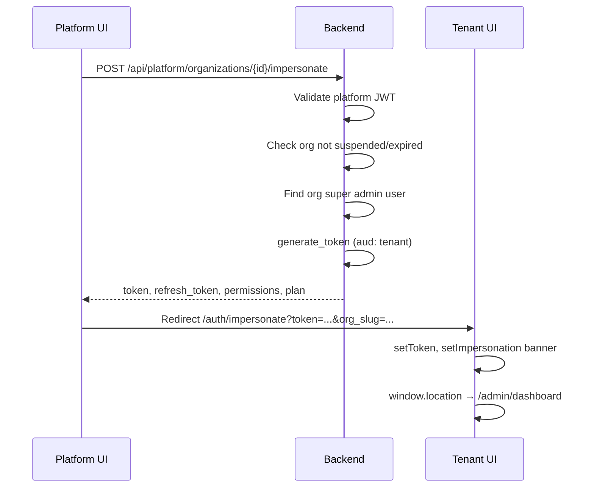

# Platform Admin — Full Documentation

The **Platform Console** is a separate React application for SaaS operators. It manages tenant organizations, subscription plans, live admin sessions, and impersonation into tenant HRM apps. It shares the same Rust backend as the tenant app but uses a **different JWT audience** (`platform` vs `tenant`).

---

## Table of contents

1. [Overview](#1-overview)
2. [Architecture](#2-architecture)
3. [Getting started](#3-getting-started)
4. [Environment variables](#4-environment-variables)
5. [Project structure](#5-project-structure)
6. [Authentication](#6-authentication)
7. [Screens & features](#7-screens--features)
8. [Organizations](#8-organizations)
9. [Subscription plans](#9-subscription-plans)
10. [Impersonation](#10-impersonation)
11. [IP tracking](#11-ip-tracking)
12. [Release notes](#12-release-notes)
13. [API reference](#13-api-reference)
14. [Database tables](#14-database-tables)
15. [How plans affect tenants](#15-how-plans-affect-tenants)
16. [Security](#16-security)
17. [Deployment](#17-deployment)
18. [Troubleshooting](#18-troubleshooting)

---

## 1. Overview

| Item | Value |
|------|-------|
| **Directory** | `platform/` |
| **Dev URL** | `http://localhost:5175` |
| **API prefix** | `/api/platform/*` |
| **Token storage** | `localStorage` key `hrm_platform_token` |
| **Backend port** | `3001` (proxied in dev) |

**What platform admins can do**

- View platform-wide metrics (orgs, users)
- Create, edit, suspend, and soft-delete tenant organizations
- Assign and renew subscription plans
- Impersonate a tenant org admin (enter their HRM workspace without their password)
- Manage subscription plan catalog (modules, pricing labels, max users)
- Monitor live tenant super-admin sessions on a map (IP / geo)
- Draft release notes (client-side storage today)

**What platform admins cannot do**

- Access tenant `/api/admin/*` routes with a platform JWT (audience mismatch)
- Delete the default organization (ID `1`)
- Impersonate suspended or subscription-expired orgs

---

## 2. Architecture

```
┌─────────────────────────┐         ┌─────────────────────────┐
│  Platform React :5175   │         │  Tenant React :5174     │
│  hrm_platform_token     │         │  hrm_token              │
└───────────┬─────────────┘         └───────────┬─────────────┘
            │  /api/platform/*                    │  /api/admin/*
            └────────────────┬────────────────────┘
                             ▼
                  ┌──────────────────────┐
                  │  Rust API :3001      │
                  │  platform_auth.rs    │  aud: "platform"
                  │  auth.rs + rbac.rs   │  aud: "tenant"
                  └──────────┬───────────┘
                             ▼
                  ┌──────────────────────┐
                  │  SQLite database     │
                  │  platform_admins     │
                  │  organizations       │
                  │  subscription_plans  │
                  └──────────────────────┘
```

**Impersonation bridge**

```
Platform UI  →  POST /api/platform/organizations/{id}/impersonate
            →  tenant JWT issued
            →  redirect to tenant app /auth/impersonate?token=...
            →  tenant stores hrm_token + impersonation banner
```

---

## 3. Getting started

### Prerequisites

- Backend running on port **3001**
- Node.js 18+

### Run platform app

```powershell
cd platform
npm install
npm run dev
```

Open **http://localhost:5175**

### First platform admin

Set environment variables **before the first backend migration**:

```powershell
$env:PLATFORM_ADMIN_EMAIL="platform@hrm.local"
$env:PLATFORM_ADMIN_PASSWORD="ChangeMe-Platform-2026!"   # min 12 characters
$env:PLATFORM_ADMIN_NAME="Platform Admin"              # optional
cd backend
cargo run
```

If not seeded, login fails until credentials are set and migrations re-run on a fresh DB.

### Production build

```powershell
cd platform
npm run build    # output: platform/dist
```

Serve `dist/` behind nginx/Caddy with `/api` proxied to the backend.

---

## 4. Environment variables

### Platform frontend (`platform/.env`)

| Variable | Default | Description |
|----------|---------|-------------|
| `VITE_TENANT_APP_URL` | `http://localhost:5174` | Target for impersonation redirect |

### Backend (shared with tenant API)

| Variable | Description |
|----------|-------------|
| `JWT_SECRET` | Signs both platform and tenant tokens (≥32 chars in release) |
| `JWT_EXPIRATION_HOURS` | Token TTL (default 24) |
| `PLATFORM_ADMIN_EMAIL` | Seed platform admin email |
| `PLATFORM_ADMIN_PASSWORD` | Seed password (min 12 chars) |
| `PLATFORM_ADMIN_NAME` | Display name for seeded admin |

### Tenant frontend (for cross-links)

| Variable | Description |
|----------|-------------|
| `VITE_PLATFORM_APP_URL` | Link back to platform from tenant app |

---

## 5. Project structure

```
platform/
├── src/
│   ├── main.tsx                    # Routes
│   ├── contexts/
│   │   └── PlatformAuthContext.tsx # Login state
│   ├── lib/
│   │   ├── platform-api.ts         # fetch wrapper, token helpers
│   │   ├── platform-nav.ts         # Sidebar navigation meta
│   │   └── app-urls.ts             # Impersonation redirect URLs
│   ├── layouts/
│   │   └── platform-layout.tsx     # Auth guard + shell
│   ├── pages/
│   │   ├── login.tsx
│   │   ├── dashboard/index.tsx
│   │   ├── users/index.tsx         # Organizations management
│   │   ├── subscription-plans/index.tsx
│   │   ├── ip-tracking/index.tsx
│   │   └── releases/index.tsx
│   └── components/
│       ├── platform-sidebar.tsx
│       ├── organizations-panel.tsx # Org CRUD + impersonate
│       ├── plan-form-modal.tsx   # Plan create/edit
│       ├── ip-tracking-map.tsx   # Leaflet map
│       └── platform-dialog.tsx
└── vite.config.ts                  # Port 5175, /api → 3001
```

**Backend handlers**

- `backend/src/handlers/platform.rs` — auth, orgs, dashboard, IP tracking
- `backend/src/handlers/subscription_plans.rs` — plan CRUD
- `backend/src/middleware/platform_auth.rs` — JWT `aud: platform`
- `backend/src/plan_limits.rs` — module catalog, permission filtering
- `backend/src/subscription_period.rs` — plan expiry, renewal

---

## 6. Authentication

### Login flow

1. User submits email/password on `/login`.
2. `POST /api/platform/auth/login` validates against `platform_admins` table (bcrypt).
3. Response: `{ token, admin: { id, name, email } }`.
4. Token saved to `localStorage` as `hrm_platform_token`.
5. All API calls send `Authorization: Bearer <token>`.

### Session validation

- On app load, `GET /api/platform/auth/me` loads current admin.
- Invalid/expired token → cleared, redirect to `/login`.
- Logout clears token and redirects to `/login`.

### JWT claims (platform)

| Claim | Value |
|-------|-------|
| `sub` | Platform admin ID |
| `email` | Admin email |
| `aud` | `"platform"` (strict) |
| `exp` / `iat` | Standard JWT timestamps |

Platform tokens **must not** be sent to `/api/admin/*` endpoints.

### Rate limiting

Platform login is rate-limited per IP + email (`rate_limit::limit_platform_login`).

---

## 7. Screens & features

### Navigation (`platform-nav.ts`)

| Sidebar | Route | Page file |
|---------|-------|-----------|
| Dashboard | `/` | `pages/dashboard/index.tsx` |
| Users | `/users` | `pages/users/index.tsx` |
| Subscription plan | `/subscription-plans` | `pages/subscription-plans/index.tsx` |
| IP tracking | `/ip-tracking` | `pages/ip-tracking/index.tsx` |
| New release pages | `/releases` | `pages/releases/index.tsx` |

### Dashboard

**Purpose:** High-level SaaS metrics.

**API:** `GET /api/platform/dashboard/stats`

**Metrics displayed**

| Stat | Source |
|------|--------|
| Organizations | `COUNT(*)` from `organizations` |
| Active | `status = 'active'` |
| Total users | All non-deleted `users` across tenants |

### Users (Organizations)

**Purpose:** Primary tenant management UI. Despite the name "Users", this page is centered on **organizations** via `OrganizationsPanel`.

**Features**

- Stats cards (same as dashboard)
- Searchable organization table
- Create organization modal (name, slug, plan, admin credentials)
- Edit organization (name, status, plan, renew subscription)
- View organization detail modal
- **Enter workspace** — impersonation
- Soft-delete organization

**API:** `/api/platform/organizations/*`, `/api/platform/dashboard/stats`

### Subscription plans

**Purpose:** Define SaaS tiers — which tenant modules are included, max users, billing period, features list.

**Features**

- List all plans with org count per plan
- Create / edit plan modal with module checkboxes
- Toggle plan active state
- Delete plan (if not in use)
- View organizations on each plan with subscription expiry badges

**API:** `/api/platform/plans/*`, `/api/platform/plans/modules`

### IP tracking

**Purpose:** See which tenant **super admins** currently have the HRM app open (last 15 minutes), with optional geo location on a Leaflet map.

**Features**

- Auto-refresh every 30 seconds
- List of live admins with org, IP, city/region/country
- Map markers for users with lat/long
- Count of admins without location data

**API:** `GET /api/platform/ip-tracking`

**Data source:** `user_presence` table, updated by tenant `POST /api/auth/presence` (super-admin heartbeat from `useAdminPresence` hook).

### Release notes

**Purpose:** Internal release changelog for platform operators.

**Storage:** `localStorage` key `hrm_platform_releases` (not persisted to backend yet).

**Features**

- Create draft or published notes (version, title, body)
- Toggle publish status
- Delete notes

> **Note:** Release notes are client-only today. Tenant apps do not consume this API yet.

---

## 8. Organizations

### Organization fields

| Field | Description |
|-------|-------------|
| `id` | Primary key |
| `name` | Display name |
| `slug` | URL-safe unique identifier (used at tenant login) |
| `status` | `active`, `suspended`, `trial`, or `deleted` |
| `plan` | Subscription plan slug (e.g. `trial`, `professional`) |
| `plan_started_at` / `plan_expires_at` | Subscription window |
| `billing_period` | From plan (e.g. `month`, `14 days`, `custom`) |
| `company_email`, `company_phone`, `country`, `timezone` | Profile fields |

### Create organization

**API:** `POST /api/platform/organizations`

**Request body**

```json
{
  "name": "Acme Corp",
  "slug": "acme",
  "plan": "trial",
  "admin_name": "Jane Admin",
  "admin_email": "admin@acme.com",
  "admin_password": "securepass123"
}
```

**Backend actions (transaction)**

1. Insert `organizations` row (`status: active`)
2. `assign_org_subscription` — set plan dates from billing period
3. Insert super-admin `users` row (`is_super_admin: 1`)
4. `seed_new_organization_defaults` — roles, permissions, `#general` chat, etc.
5. `sync_role_defaults` — global role template sync

### Update organization

**API:** `PATCH /api/platform/organizations/{id}`

```json
{
  "name": "Acme Corporation",
  "status": "active",
  "plan": "professional",
  "renew_subscription": true
}
```

| Field | Effect |
|-------|--------|
| `status` | `active`, `suspended`, or `trial` |
| `plan` | Changes plan; re-assigns subscription period if slug changes |
| `renew_subscription: true` | Extends `plan_expires_at` from current plan billing period |

### Delete organization

**API:** `DELETE /api/platform/organizations/{id}`

- Soft delete: `status = 'deleted'`, slug suffixed with `-deleted-{id}`
- All org users get `deleted_at` set
- Default org (ID `1`) cannot be deleted

### Organization list response (summary)

Each row includes: `id`, `name`, `slug`, `status`, `plan`, `email`, `phone`, `user_count`, `created_at`, `plan_started_at`, `plan_expires_at`, `billing_period`, `days_remaining`, `subscription_expired`.

Detail view adds: `country`, `timezone`, `admin_name`, `admin_email`, `admin_phone`, `company_email`, `company_phone`.

---

## 9. Subscription plans

### Default seeded plans

| Slug | Name | Max users | Billing | Modules (summary) |
|------|------|-----------|---------|-------------------|
| `trial` | Trial | 10 | 14 days | Core: dashboard, users, settings, departments, designations, attendance, leave, holidays |
| `starter` | Starter | 50 | month | + centers, shifts, biometric |
| `professional` | Professional | 200 | month | + careers, applications, payroll, workflows, tasks, projects, reports |
| `enterprise` | Enterprise | unlimited (0) | custom | All modules, no expiry |

### Plan schema (`subscription_plans`)

| Column | Description |
|--------|-------------|
| `name` | Display name |
| `slug` | Unique key referenced by `organizations.plan` |
| `price_label` | Display price (e.g. `₹7,999`) |
| `billing_period` | `14 days`, `month`, `3 months`, `6 months`, `year`, `custom` |
| `max_users` | Cap enforced on user creation (`0` = unlimited) |
| `modules` | JSON array of module keys |
| `features` | JSON array of marketing feature strings |
| `is_active` | Whether selectable for new orgs |
| `sort_order` | UI ordering |

### Module catalog keys

From `plan_limits::MODULE_CATALOG`:

`dashboard`, `users`, `centers`, `settings`, `departments`, `designations`, `careers`, `job_applications`, `chat`, `attendance`, `shifts`, `biometric`, `leave`, `holidays`, `payroll`, `workflows`, `tasks`, `projects`, `reports`

### Plan API

| Method | Path | Description |
|--------|------|-------------|
| GET | `/api/platform/plans` | List all plans |
| GET | `/api/platform/plans/modules` | Module catalog for checkboxes |
| POST | `/api/platform/plans` | Create plan |
| PATCH | `/api/platform/plans/{id}` | Update plan |
| DELETE | `/api/platform/plans/{id}` | Delete (blocked if orgs assigned) |

---

## 10. Impersonation

Allows platform support staff to open a tenant HRM session as that org's super admin.

### Flow



### Impersonation API response

```json
{
  "token": "<tenant JWT>",
  "refresh_token": "<uuid>",
  "user": { "...": "user summary" },
  "permissions": ["view-dashboard", "..."],
  "plan": { "slug": "professional", "modules": ["..."] },
  "settings": { "company_name": "..." },
  "impersonated_by_platform_admin_id": 1,
  "organization_id": 5,
  "org_slug": "acme"
}
```

### Blocks

| Condition | HTTP |
|-----------|------|
| Org not found | 404 |
| Org suspended | 403 |
| Subscription expired | 403 |
| No users in org | 404 |

### Tenant-side handling

- `frontend/src/pages/auth/impersonate.tsx` — reads query params, stores tokens
- `frontend/src/lib/impersonation.ts` — session flag for banner
- `frontend/src/components/impersonation-banner.tsx` — visible warning bar

### Redirect URL builder

`platform/src/lib/app-urls.ts`:

- `tenantAppUrl()` — from `VITE_TENANT_APP_URL`
- `defaultAdminRoute(hasPermission)` — first allowed admin page after impersonation
- `redirectToTenantImpersonation(...)` — full cross-origin redirect

---

## 11. IP tracking

### How presence is recorded

1. Tenant super admin has HRM app open.
2. `useAdminPresence` hook (tenant frontend) periodically calls `POST /api/auth/presence`.
3. Body includes optional geo: latitude, longitude, city, region, country, accuracy.
4. Backend upserts `user_presence` for that user.

### Platform query

`GET /api/platform/ip-tracking` returns users where:

- `is_super_admin = 1`
- `last_active_at >= now - 15 minutes`
- Org not deleted

### Response shape

```json
{
  "users": [
    {
      "id": 1,
      "name": "Admin",
      "email": "admin@acme.com",
      "organization_name": "Acme",
      "organization_slug": "acme",
      "ip_address": "203.0.113.1",
      "latitude": 12.97,
      "longitude": 77.59,
      "city": "Bengaluru",
      "region": "Karnataka",
      "country": "IN",
      "last_active_at": "2026-06-05 10:30:00",
      "has_location": true
    }
  ],
  "active_count": 1,
  "without_location_count": 0,
  "updated_at": "2026-06-05 10:31:00"
}
```

### Privacy note

Only **tenant super admins** are tracked, not every employee. Geo requires browser permission on the tenant app.

---

## 12. Release notes

**Route:** `/releases`  
**Storage:** Browser `localStorage` only (`hrm_platform_releases`)

| Field | Description |
|-------|-------------|
| `id` | Generated client ID |
| `version` | Semver string |
| `title` | Headline |
| `body` | Markdown/plain description |
| `published_at` | Date string |
| `status` | `draft` or `published` |

Future enhancement: persist to backend and show in tenant app changelog.

---

## 13. API reference

All endpoints require `Authorization: Bearer <platform_token>` unless noted.

Base path: `/api/platform`

### Auth

| Method | Path | Body | Response |
|--------|------|------|----------|
| POST | `/auth/login` | `{ email, password }` | `{ token, admin }` |
| GET | `/auth/me` | — | `{ id, name, email }` |

### Dashboard

| Method | Path | Response |
|--------|------|----------|
| GET | `/dashboard/stats` | `{ total_organizations, active_organizations, total_users }` |

### Users (cross-tenant listing)

| Method | Path | Description |
|--------|------|-------------|
| GET | `/users` | All tenant users with org name (debug/support) |

### Organizations

| Method | Path | Description |
|--------|------|-------------|
| GET | `/organizations` | List non-deleted orgs |
| POST | `/organizations` | Create org + admin |
| GET | `/organizations/{id}` | Detail |
| PATCH | `/organizations/{id}` | Update |
| DELETE | `/organizations/{id}` | Soft delete |
| POST | `/organizations/{id}/impersonate` | Issue tenant JWT |

### Subscription plans

| Method | Path | Description |
|--------|------|-------------|
| GET | `/plans` | List plans |
| GET | `/plans/modules` | Module catalog |
| POST | `/plans` | Create |
| PATCH | `/plans/{id}` | Update |
| DELETE | `/plans/{id}` | Delete |

### IP tracking

| Method | Path | Description |
|--------|------|-------------|
| GET | `/ip-tracking` | Live super-admin sessions |

### Response envelope

All platform APIs use the standard envelope:

```json
{
  "success": true,
  "data": { ... },
  "message": "optional"
}
```

Errors:

```json
{
  "success": false,
  "message": "Error description"
}
```

---

## 14. Database tables

| Table | Platform usage |
|-------|----------------|
| `platform_admins` | Operator login accounts |
| `organizations` | Tenants |
| `subscription_plans` | Plan catalog |
| `users` | Tenant employees (impersonation target) |
| `user_presence` | IP tracking data |
| `jwt_refresh_tokens` | Issued on impersonation for tenant refresh |

### `platform_admins` schema

| Column | Type | Notes |
|--------|------|-------|
| `id` | INTEGER | PK |
| `name` | TEXT | |
| `email` | TEXT | Unique |
| `password` | TEXT | bcrypt hash |

---

## 15. How plans affect tenants

When a tenant user logs in or calls `/api/auth/me`:

1. `plan_limits::load_org_plan` reads org's `plan` slug.
2. `permissions_for_module` maps each subscribed module → RBAC slugs.
3. `apply_plan_to_permissions` filters user's role permissions to plan subset.
4. Frontend `planModules` hides sidebar items via `isModuleAllowed()`.
5. `subscription_expired` flag shows `SubscriptionExpiryBanner` in tenant app.

**Enforcement points**

- User creation checks `max_users`.
- API middleware applies plan-filtered permissions.
- `ensure_org_subscription_enforced` blocks API access when expired.
- Impersonation blocked on expired subscription.

---

## 16. Security

| Control | Implementation |
|---------|----------------|
| Separate JWT audience | `aud: platform` vs `aud: tenant` |
| Platform password | Min 12 chars for seed; bcrypt storage |
| Login rate limit | Per IP + email |
| Impersonation audit | Response includes `impersonated_by_platform_admin_id` |
| Org delete protection | Default org ID 1 forbidden |
| Suspended orgs | Cannot impersonate |
| CORS | Dev origins 5173–5175; use same-origin proxy in production |

**Operational guidance**

- Use strong `JWT_SECRET` shared by both apps.
- Restrict platform admin count; no self-signup for platform.
- Serve platform on separate subdomain (e.g. `platform.example.com`).
- Do not expose platform UI on public internet without TLS and IP allowlist if needed.

---

## 17. Deployment

### Example layout

| Host | Serves |
|------|--------|
| `app.example.com` | Tenant `frontend/dist` + `/api` proxy |
| `platform.example.com` | Platform `platform/dist` + `/api` proxy |

Both static sites proxy `/api` to the same backend instance.

### Build commands

```powershell
cd backend && cargo build --release
cd frontend && npm run build
cd platform && npm run build
```

### Env at deploy time

```bash
VITE_TENANT_APP_URL=https://app.example.com    # platform build
VITE_PLATFORM_APP_URL=https://platform.example.com  # tenant build
PLATFORM_ADMIN_EMAIL=ops@yourcompany.com
PLATFORM_ADMIN_PASSWORD=<strong-password>
JWT_SECRET=<32+ char secret>
```

---

## 18. Troubleshooting

| Symptom | Cause | Fix |
|---------|-------|-----|
| Cannot login to platform | Admin not seeded | Set `PLATFORM_ADMIN_*` env, check `platform_admins` table |
| 401 on all platform API calls | Wrong/expired token | Log out, clear `hrm_platform_token`, login again |
| Impersonation opens blank/error | `VITE_TENANT_APP_URL` wrong | Set to tenant app origin at platform build time |
| Impersonation 403 | Org suspended or subscription expired | Renew plan in Subscription plans page |
| IP tracking empty | No super admin online | Open tenant app as super admin; wait for presence heartbeat |
| Plan change not reflected | Cached `/auth/me` | Tenant user must re-login or refresh |
| CORS errors in production | Direct API calls cross-origin | Proxy `/api` on same host as each SPA |

---

## Related documentation

- [Module index — Platform](modules/platform.md)
- [Auth & Onboarding — impersonation](modules/auth-onboarding.md)
- [Full project documentation](DOCUMENTATION.md)
