# Raintech HRM — Full Project Workflow Chart

Visual map of system architecture, user journeys, and cross-module data flows.

---

## 1. System topology

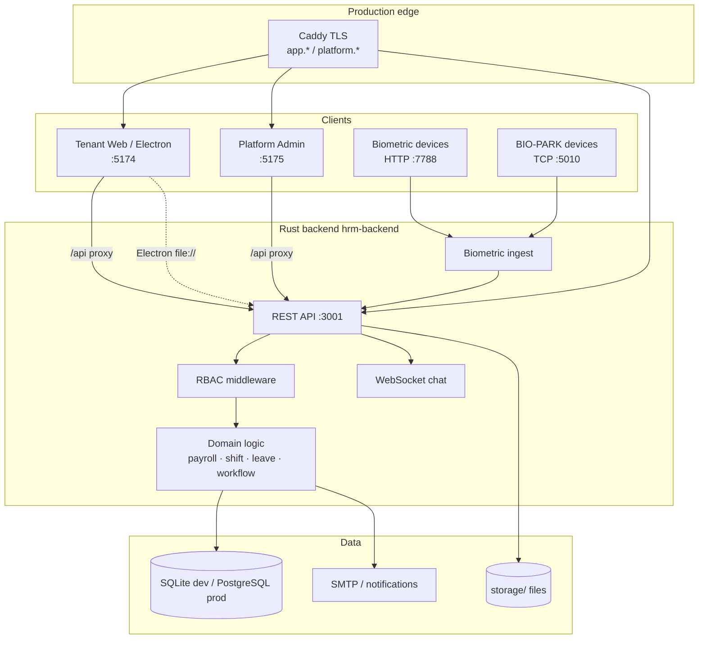

---

## 2. Multi-tenant request flow

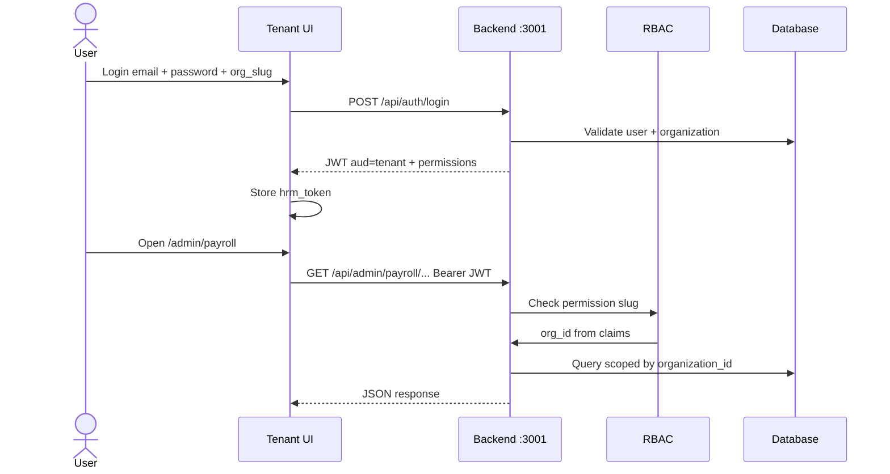

---

## 3. Authentication & onboarding

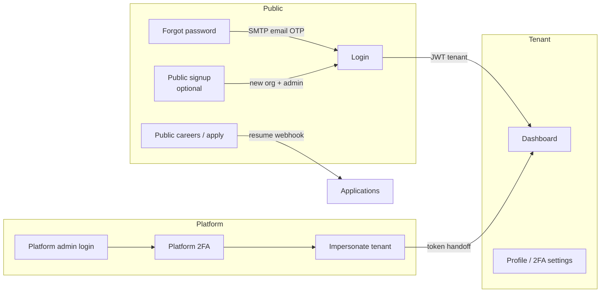

---

## 4. Leave policy → manage → attendance → payroll

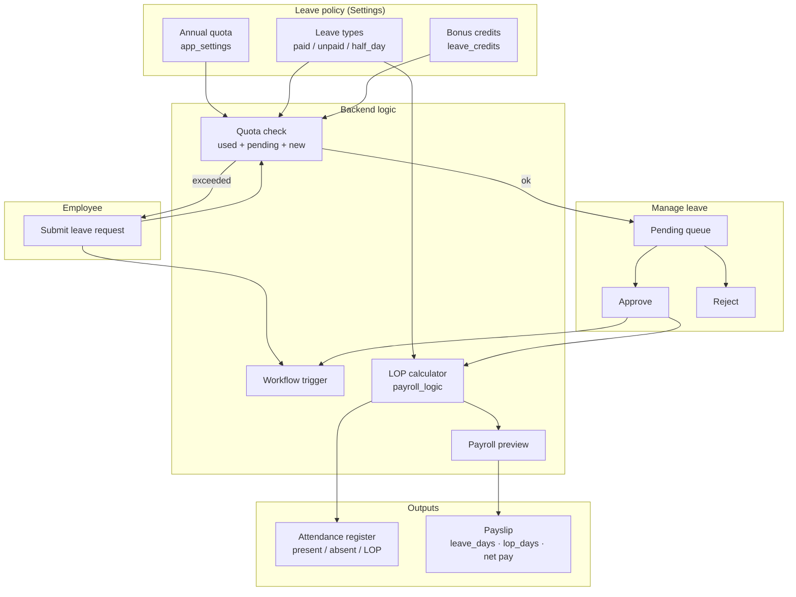

**Per working day LOP decision**

| Condition | LOP |
|-----------|-----|
| Present (clock-out done) or paid holiday | 0 |
| Open clock-in today (no clock-out yet) | 0 (wait) |
| Approved unpaid leave | 1.0 |
| Approved half-day leave | 0.5 |
| Approved paid leave | 0 |
| No attendance, no leave | 1.0 (absent) |

---

## 5. Attendance & biometric pipeline

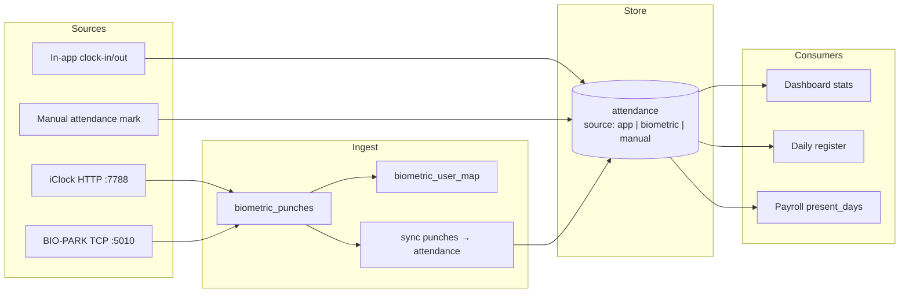

---

## 6. Shift → roster → payroll month

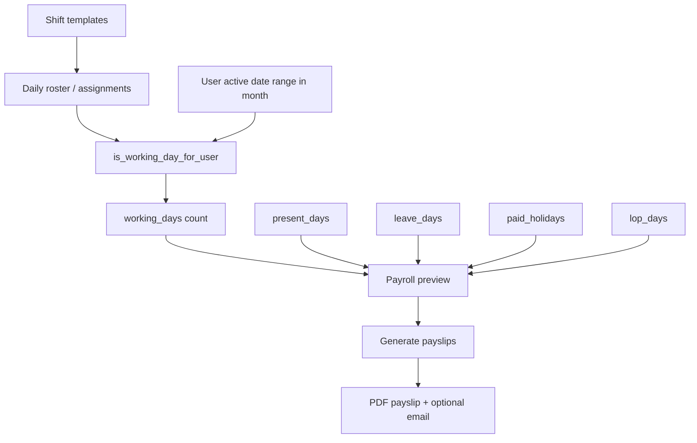

---

## 7. Workflow automation engine

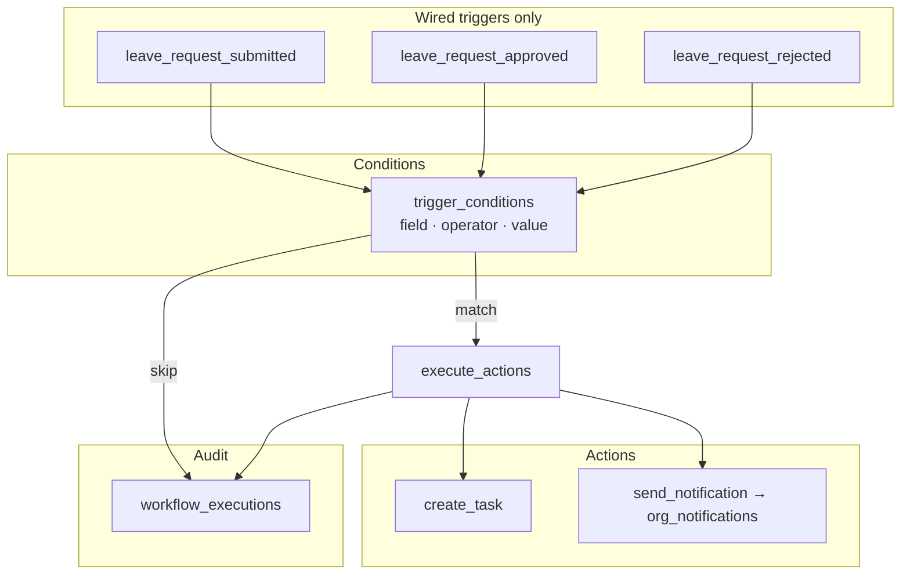

**UI action shape** `{ type, config }` is normalized on save to flat JSON the engine executes.

---

## 8. Payroll generation workflow

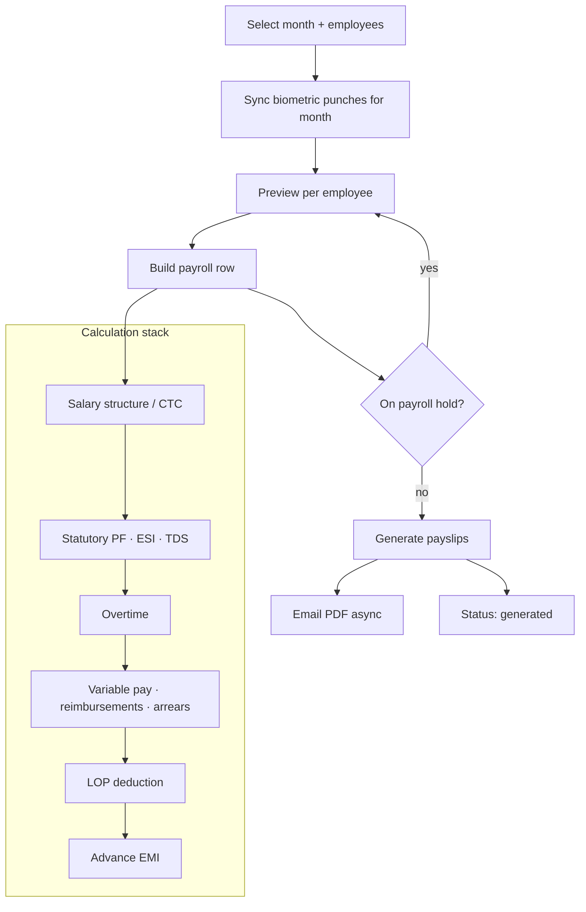

---

## 9. Platform SaaS admin workflow

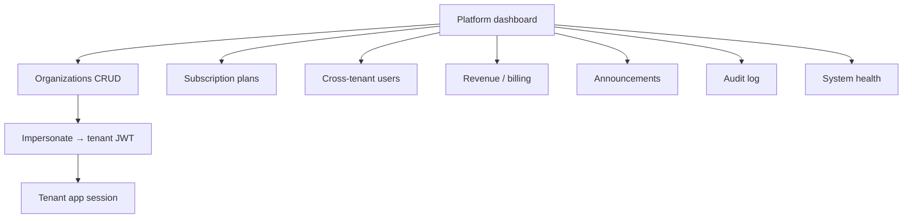

---

## 10. Recruitment workflow

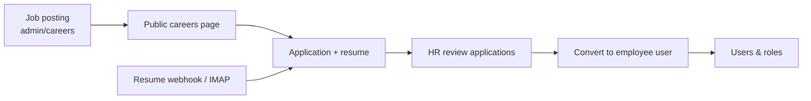

---

## 11. Electron desktop app flow

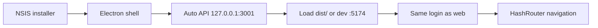

---

## 12. CI / QA test workflow

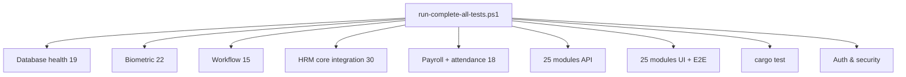

**Maintenance after marathon runs**

```text
python scripts/prune-qa-workflow-tasks.py
VACUUM database.sqlite   # if DB-08 fragmentation fails
```

---

## 13. Production deploy workflow (AWS / Docker)

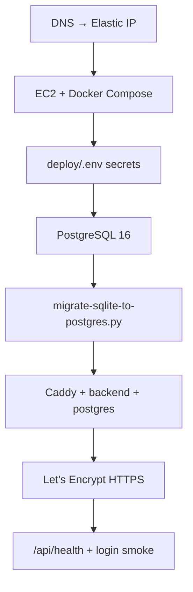

| URL | Role |
|-----|------|
| `https://app.domain` | Tenant HRM |
| `https://platform.domain` | Platform admin |
| `http://server-ip:7788` | Biometric push (no TLS) |

---

## 14. Tenant module map (25 modules)

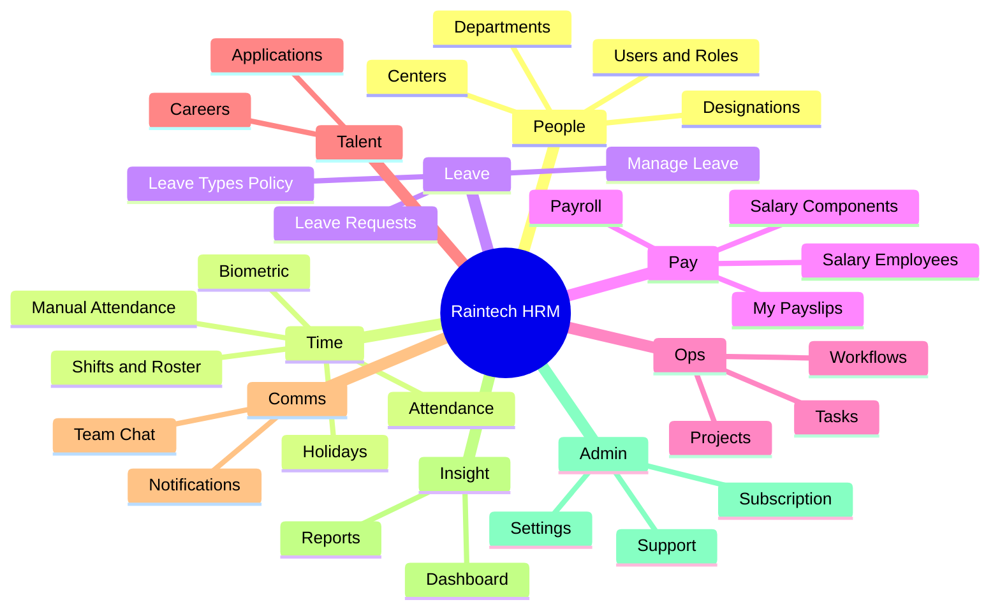

---

## 15. Data dependency graph (core HR loop)

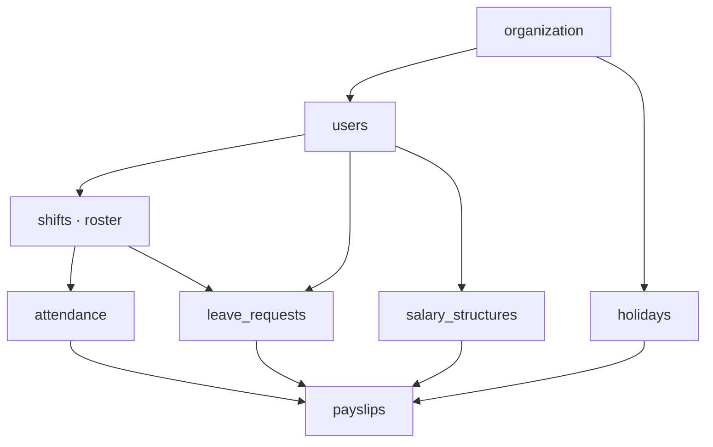

---

## Quick reference — ports

| Service | Dev | Production |
|---------|-----|------------|
| API | 3001 | 443 `/api` via Caddy |
| Tenant UI | 5174 | `app.domain` |
| Platform UI | 5175 | `platform.domain` |
| Biometric HTTP | 7788 | 7788 (LAN) |
| BIO-PARK TCP | 5010 | 5010 (LAN) |

---

*Generated for Raintech HRM monorepo. See also [DOCUMENTATION.md](DOCUMENTATION.md), [PRODUCTION.md](PRODUCTION.md), [modules/README.md](modules/README.md).*
