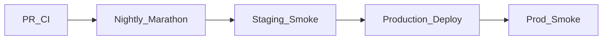

# Raintech HRM — Production QA Strategy & Test Documentation

| Field | Value |
|-------|-------|
| **Product** | Raintech HRM (multi-tenant SaaS HRMS) |
| **Domain** | HR / Attendance / India Payroll / Benefits / Automation |
| **Architecture** | Rust (Actix) API · React tenant app · React platform console · Postgres · PWA · Electron |
| **Standards** | ISTQB Foundation / Agile Tester · OWASP ASVS L1–L2 · WCAG 2.2 AA (target) |
| **Document version** | 1.0 |
| **Status** | Production-ready baseline |
| **Last verified against** | Local marathon green (26 suites pass); ports API `:3001`, tenant `:5174`, platform `:5175`, Postgres `:5433` |

---

## 1. Test Strategy

### 1.1 Objectives
1. Protect payroll, leave, attendance, and multi-tenant isolation (highest business risk).
2. Ensure plan gating + RBAC cannot be bypassed.
3. Validate workflows / webhooks / email / WhatsApp integrations without corrupting domain data.
4. Keep deployment confidence via smoke + regression aligned with existing CI (`test.yml`, `nightly-tests.yml`).

### 1.2 Scope

**In scope**
- Tenant app modules (catalog keys in `backend/src/plan_limits.rs`)
- Platform console (orgs, plans, billing invoices, support, releases)
- Auth (JWT, TOTP 2FA, signup/password-reset OTP email/WhatsApp)
- Biometric ingest, shifts, India payroll/statutory
- Workflow engine, outbound webhooks, manager self-service, geofence attendance
- PWA + Electron packaging smoke
- API, DB integrity, security, performance baselines

**Out of scope (unless contracted)**
- Full Workday-parity feature certification
- Hardware biometric device certification lab
- Formal WCAG legal audit (recommend third party annually)
- Chaos engineering of cloud provider regions (recommend Stage 2)

### 1.3 Test levels (V-model / Agile hybrid)

```text
Unit (Rust cargo test, Vitest)
  → API / Component integration (Python suites, Playwright API)
    → System (module catalog, E2E, marathon)
      → UAT (business scenarios)
        → Production smoke
```

### 1.4 Entry / exit criteria

| Gate | Entry | Exit |
|------|-------|------|
| **PR CI** | Branch builds | `cargo test` + Vitest + targeted Python suites green |
| **Nightly** | Main stable | `run-complete-all-tests.ps1` green |
| **Release** | Nightly green ≤24h | Smoke checklist signed; no open P0/P1 |
| **UAT** | Staging seeded | Critical UAT scenarios accepted by HR sponsor |

### 1.5 Environments

| Env | Purpose | Notes |
|-----|---------|-------|
| Local | Dev + marathon | Docker Postgres `:5433` |
| CI | PR / nightly | Ephemeral DB |
| Staging | UAT / perf | Mirror prod config; OTP bypass off |
| Production | Live | Smoke only; never destructive payroll tests |

### 1.6 Risk-based priority

| Risk area | Business impact | Test depth |
|-----------|-----------------|------------|
| Multi-tenant isolation | Critical | Every release |
| Payroll generate / payslip lock | Critical | Every release + UAT |
| Leave approve + quota | Critical | Every release |
| Attendance clock / biometric sync | Critical | Every release |
| Auth / 2FA / JWT | Critical | Security suite every PR |
| Workflows / webhooks | High | Workflow suite + integration |
| Plan gating / RBAC | High | Permission matrix |
| Chat / careers / assets | Medium | Module smoke + CRUD |
| UI polish / PWA | Medium | Visual + responsive spot checks |

---

## 2. Test Plan (Execution Framework)

### 2.1 Roles & responsibilities

| Role | Responsibility |
|------|----------------|
| QA Lead | Strategy, RTM, sign-off |
| QA Engineers | Cases, execution, bugs |
| SDET | Playwright / Newman / k6 automation |
| Backend Eng | Unit tests, API contract |
| Product / HR SME | UAT acceptance |
| DevOps | CI, environments, backups |

### 2.2 Schedule (recommended release train)

| Phase | When | Suite |
|-------|------|-------|
| Continuous | Every PR | `.github/workflows/test.yml` |
| Nightly | 02:00 UTC | `nightly-tests.yml` → `run-complete-all-tests.ps1` |
| Pre-release | T-1 day | Full marathon + security + DB health |
| Deploy day | T0 | Smoke checklist §10 |
| Post-release | T+1 | Monitoring + selected UAT |

### 2.3 Existing automation map (reuse first)

| Asset | Path / command | Layer |
|-------|----------------|-------|
| Marathon orchestrator | `scripts/run-complete-all-tests.ps1` | System |
| Module API catalog | `scripts/test-all-24-modules.py` | Functional API |
| Workflow engine | `scripts/test-workflow-suite.py` | Integration |
| Core HR chain | `scripts/test-hrm-core-integration-suite.py` | Integration |
| Payroll ↔ attendance | `scripts/test-payroll-attendance-suite.py` | Integration |
| Auth security | `scripts/test-auth-security-suite.py` | Security |
| SaaS isolation | `scripts/test-saas-suite.py` | Security / multi-tenant |
| Validation | `scripts/test-validation-suite.py` | Negative / BVA |
| DB health | `scripts/test-database-health.py` | Database |
| Playwright E2E | `frontend` Playwright + `scripts/e2e-targeted-flows.mjs` | UI E2E |
| Rust units | `cd backend; cargo test` | Unit |
| Vitest | `cd frontend; npm run test` | Unit |

---

## 3. Functional Testing

### 3.1 Techniques applied
- **Equivalence partitioning (EP):** valid/invalid emails, leave date ranges, payroll months
- **Boundary value analysis (BVA):** plan `max_users`, leave quota, geofence radius, OTP length
- **Decision tables:** leave approve vs reject vs overlapping payslip; geofence flag vs reject
- **State transition:** leave `pending → approved|rejected`; payslip `draft → generated`
- **Business rules:** org-scoped queries; plan module gating; manager direct-report scope

### 3.2 Cross-cutting functional scenarios

| ID | Scenario | Priority |
|----|----------|----------|
| F-GEN-01 | Login with org slug succeeds; wrong org fails | Critical |
| F-GEN-02 | Expired subscription blocks admin routes | Critical |
| F-GEN-03 | User at plan seat limit cannot be created | High |
| F-GEN-04 | Soft-deleted users excluded from lists/payroll | High |
| F-GEN-05 | Module not on plan returns 403 / hidden nav | Critical |

### 3.3 Module packs — objectives, scenarios, sample cases

For each module: **Objective · Scope · Preconditions · Scenarios · Sample cases · Priority · Automation · Risks**.

---

#### MOD-AUTH — Authentication & Session

| | |
|--|--|
| **Objective** | Secure tenant/platform identity |
| **Scope** | Login, refresh, logout, 2FA, OTP signup/reset |
| **Preconditions** | Org exists; SMTP/MSG91 configured or bypass flagged for QA |
| **Risks** | Token leakage; pre-auth JWT abuse; OTP brute force |

| Case ID | Type | Steps (summary) | Expected | Pri | Auto |
|---------|------|-----------------|----------|-----|------|
| AUTH-P-01 | + | Valid email/password/org | 200 + tenant JWT | C | Y |
| AUTH-N-01 | − | Wrong password | 401; no token | C | Y |
| AUTH-N-02 | − | Missing org slug | 400 | H | Y |
| AUTH-B-01 | BVA | Password length min-1 / min / max | Reject / accept | H | Y |
| AUTH-P-02 | + | 2FA enabled user → pre-auth → TOTP verify | Full JWT | C | Y |
| AUTH-N-03 | − | Invalid TOTP | Reject; rate limited | C | Y |
| AUTH-P-03 | + | Refresh rotates access | New token works | H | Y |
| AUTH-N-04 | − | Expired JWT on admin API | 401 | C | Y |

---

#### MOD-USERS — Users & Roles

| | |
|--|--|
| **Objective** | Org user lifecycle + RBAC assignment |
| **Scope** | CRUD users, roles, manager links, capacity |
| **Preconditions** | Admin with `users` module; plan capacity available |

| Case ID | Type | Steps | Expected | Pri | Auto |
|---------|------|-------|----------|-----|------|
| USR-P-01 | + | Create user with roles + reporting_manager | 201; welcome email queued | C | Y |
| USR-N-01 | − | Duplicate email in org | 400 | H | Y |
| USR-N-02 | − | Assign permission outside plan | Rejected | C | Y |
| USR-B-01 | BVA | Create at max_users and max_users+1 | Last OK / capacity error | C | Y |
| USR-P-02 | + | Soft delete user | Hidden from active lists | H | Y |
| USR-N-03 | − | Manager edits user in another org (token swap) | 404/403 | C | Y |

---

#### MOD-ATT — Attendance / Clock / Geofence

| | |
|--|--|
| **Objective** | Accurate present/late/early; geo policy |
| **Scope** | Clock in/out, manual, bulk, out-of-zone |
| **Dependencies** | Shifts; center lat/lng/radius; optional face |

| Case ID | Type | Steps | Expected | Pri | Auto |
|---------|------|-------|----------|-----|------|
| ATT-P-01 | + | Clock-in on scheduled workday | present; workflow `attendance_clock_in` | C | Y |
| ATT-P-02 | + | Clock-in after grace → late | `is_late=true`; `attendance_late` workflow | C | Y |
| ATT-N-01 | − | Clock-in on day off | 400 | H | Y |
| ATT-N-02 | − | Clock-in while approved leave | 409 | H | Y |
| ATT-P-03 | + | Outside geofence, policy=flag | 200 + `out_of_zone=true` | H | Y |
| ATT-N-03 | − | Outside geofence, policy=reject | 400 | H | Y |
| ATT-P-04 | + | Manual absent entry | Status absent; workflow | M | Y |
| ATT-E-01 | Edge | Double clock-in open session | Prior session closed / duplicate ignored | H | Y |

---

#### MOD-BIO — Biometric

| Case ID | Type | Steps | Expected | Pri | Auto |
|---------|------|-------|----------|-----|------|
| BIO-P-01 | + | Device push punch maps to user | Attendance row source=biometric | C | Y |
| BIO-N-01 | − | Unknown device SN | Reject/log | H | Y |
| BIO-P-02 | + | Late punch uses shift grace | `is_late` correct | C | Y |

---

#### MOD-LEAVE — Leave & Manage Leave

| Case ID | Type | Steps | Expected | Pri | Auto |
|---------|------|-------|----------|-----|------|
| LV-P-01 | + | Employee submits leave | pending; workflow submit | C | Y |
| LV-P-02 | + | Admin/manager approves | approved; credit/quota; workflow | C | Y |
| LV-N-01 | − | Overlap existing pending/approved | 400 | C | Y |
| LV-N-02 | − | Exceed annual quota | 400 with message | C | Y |
| LV-N-03 | − | Approve overlapping generated payslip | 409 | C | Y |
| LV-P-03 | + | Manager approves direct report only | OK | C | Y |
| LV-N-04 | − | Manager approves non-report | 403 | C | Y |
| LV-B-01 | BVA | days_count 0 / 0.5 / max | Reject / accept / reject | H | P |

---

#### MOD-PAY — Payroll & Payslips

| Case ID | Type | Steps | Expected | Pri | Auto |
|---------|------|-------|----------|-----|------|
| PAY-P-01 | + | Preview month for salaried employee | Gross/net consistent | C | Y |
| PAY-P-02 | + | Generate draft → generated | Locked; workflow + webhook | C | Y |
| PAY-N-01 | − | Generate already generated | Skip/idempotent | H | Y |
| PAY-P-03 | + | Late days show suggested penalty not auto | Matches suite SP-10 | H | Y |
| PAY-P-04 | + | PDF download authorized | 200 PDF | H | Y |
| PAY-N-02 | − | Employee downloads other’s payslip | 403/404 | C | Y |

---

#### MOD-WF — Workflows

| Case ID | Type | Steps | Expected | Pri | Auto |
|---------|------|-------|----------|-----|------|
| WF-P-01 | + | Create leave_submit → create_task | Task + execution | C | Y |
| WF-P-02 | + | Conditions filter leave_type | Skip when unmatched | H | Y |
| WF-P-03 | + | Test with sample payload | Execution row | H | Y |
| WF-N-01 | − | Unsupported trigger on create | 400 | H | Y |
| WF-P-04 | + | Actions: webhook / WhatsApp / notify_manager | Partial/completed statuses | H | P |

---

#### MOD-INT — Integrations Hub

| Case ID | Type | Steps | Expected | Pri | Auto |
|---------|------|-------|----------|-----|------|
| INT-P-01 | + | Register webhook + secret once | 201 | H | Y |
| INT-P-02 | + | leave.approved delivery signed | `X-HRM-Signature` | H | Y |
| INT-N-01 | − | Inactive webhook | No delivery | M | Y |
| INT-P-03 | + | OpenAPI lists manager + webhooks | Catalog match | M | Y |

---

#### Other modules (condensed)

| Module | Critical scenarios | Pri |
|--------|-------------------|-----|
| Centers / depts / designations | CRUD; geofence fields; dept→center link | H |
| Shifts / roster | Assign general shift; day-off blocks clock-in | C |
| Holidays | Org holiday excludes working days | H |
| Careers / applications | Public careers; admin CRUD; resume webhook | M |
| Chat | Spaces; dept channel sync on user create | M |
| Doctor reports | Publish → employee email + workflow | H |
| Grocery / assets | Claim/expense submit → admin notify + workflow | H |
| Tasks / projects | CRUD; overdue worker trigger | M |
| Reports | Attendance summary; out-of-zone; leave balance | H |
| Subscription | Upgrade request; plan modules reflected | H |
| Notifications / support | Org broadcast; ticket CRUD | M |
| Settings | SMTP, MSG91, geofence_policy | H |
| Manager team | Team attendance/leave scoped | C |
| Platform console | Tenant isolation; invoice paid via Razorpay webhook | C |

### 3.4 Input validation matrix (examples)

| Field | Valid | Invalid | Boundary |
|-------|-------|---------|----------|
| Email | `a@b.co` | `a@`, spaces | max length |
| Org slug | `mashuptech` | empty, SQL meta | charset |
| Leave dates | start≤end | end\<start | same-day |
| Amount (claims) | 0.01–allowance | negative, NaN | =allowance |
| Lat/lng | −90..90 / −180..180 | 999 | ± |
| JWT | Bearer well-formed | Missing, garbage | expired skew |

---

## 4. UI/UX Testing

### 4.1 Scope
Tenant (`:5174`) + Platform (`:5175`) + PWA standalone + Electron shell.

### 4.2 Checklist

- [ ] Sidebar modules match plan; no orphan routes
- [ ] Breadcrumbs consistent on CRUD pages
- [ ] Forms: required markers, inline errors, toast success/fail
- [ ] Tables: empty, loading, pagination, sort affordances
- [ ] Destructive actions use confirm dialogs
- [ ] Dark/light (if supported) contrast acceptable
- [ ] Keyboard: tab order on login, leave form, payroll generate
- [ ] Mobile 375 / 390 / 414 widths: punch, leave, nav
- [ ] Tablet 768 / Desktop 1280 / 1440 / 1920
- [ ] No horizontal scroll on primary flows (except wide reports)
- [ ] Error copy actionable (not raw “db error” for users)

### 4.3 Accessibility (WCAG 2.2 AA target)

| ID | Check | Pri |
|----|-------|-----|
| A11Y-01 | Login inputs labeled | H |
| A11Y-02 | Color not sole status signal (badges + text) | H |
| A11Y-03 | Focus visible on buttons/links | H |
| A11Y-04 | Dialogs trap focus | M |
| A11Y-05 | PDF/payslip download announced | M |

### 4.4 Cross-browser

| Browser | Versions | Priority |
|---------|----------|----------|
| Chrome / Edge | last 2 | Critical |
| Firefox | last 2 | High |
| Safari macOS/iOS | last 2 | High (PWA) |
| Electron Chromium | bundled | Critical for desktop SKU |

---

## 5. API Testing

### 5.1 Conventions
- Base: `/api`
- Auth: `Authorization: Bearer <JWT>`
- Tenant scoping via claims `organization_id` / `org_slug`
- Catalog: `/api/openapi.json`

### 5.2 Mandatory API checks per resource

| Check | Expect |
|-------|--------|
| Unauthenticated | 401 |
| Wrong org data ID | 404/403 |
| Missing permission | 403 |
| Validation fail | 400 + message |
| Create | 201 + id |
| List pagination | `page`/`per_page` bounds |
| Filter/sort | Stable ordering |
| Idempotent regenerate payslip | No double pay |

### 5.3 AuthZ route samples

| Route | Permission / rule |
|-------|-------------------|
| `POST .../attendance/clock-in` | `clock-inout` |
| `POST .../attendance/manual` | `mark-attendance` |
| `POST .../leave-requests/{id}/approve` | `approve-leave-requests` |
| `GET .../manager/*` | manager scope + attendance/leave perms |
| `* .../integrations/webhooks` | `manage-settings` |
| Platform routes | platform admin JWT audience |

### 5.4 Rate limiting & security headers
- Brute-force login / OTP: suite `test-auth-security-suite.py`
- Verify elevated limits in QA env don’t mask prod throttles
- Webhook signature: `X-HRM-Signature: sha256=<hmac>`

### 5.5 Status code table

| Situation | Code |
|-----------|------|
| Success | 200 |
| Created | 201 |
| Validation | 400 |
| Unauthorized | 401 |
| Forbidden | 403 |
| Not found | 404 |
| Conflict (leave/payslip) | 409 |
| Upstream (MSG91) | 502 |

---

## 6. Database Testing

### 6.1 Scope
PostgreSQL primary (`DATABASE_URL`); migrations via bootstrap + `migrations.rs`.

### 6.2 Checklist

- [ ] CRUD reflects API for users, attendance, leave, payslips, workflows
- [ ] FK integrity: user→org, attendance→user, leave→user
- [ ] Unique: org slug, user email per org, refresh tokens
- [ ] Soft delete (`deleted_at`) excluded from business queries
- [ ] Payslip status transitions atomic on generate
- [ ] Workflow executions written on trigger
- [ ] Tenant webhook deliveries logged
- [ ] Geofence columns on `centers` / `out_of_zone` on `attendance`
- [ ] No cross-org rows in tenant queries (isolation suite)
- [ ] Backup/restore drill: restore staging from nightly dump; smoke

### 6.3 Data integrity scenarios

| ID | Scenario | Expected |
|----|----------|----------|
| DB-01 | Delete center with departments | Blocked |
| DB-02 | Approve leave concurrent double-submit | One wins; other conflict |
| DB-03 | Generate payslip concurrent | Single generated |
| DB-04 | Migration on dirty DB | Idempotent ALTERs |

---

## 7. Security Testing (OWASP Top 10)

| OWASP | Raintech focus | Cases / suite |
|-------|----------------|---------------|
| A01 Broken Access Control | Org isolation; manager scope; plan perms | SaaS + auth suites; IDOR IDs |
| A02 Crypto failures | JWT secret; password hashes; webhook HMAC | Config review |
| A03 Injection | SQL via params layer; search fields | Fuzz search/sort |
| A04 Insecure design | Pre-auth JWT short TTL; OTP | AUTH cases |
| A05 Misconfig | CORS; debug OTP bypass off in prod | Deploy checklist |
| A06 Vulnerable components | Cargo/npm audit in CI | Add scheduled audit job |
| A07 Auth failures | Login/OTP rate limits; 2FA | `test-auth-security-suite.py` |
| A08 Data integrity | Razorpay signature; webhook HMAC | Forged signature rejected |
| A09 Logging failures | Auth failures logged; no secrets in logs | Log review |
| A10 SSRF | Workflow/outbound webhook URL | Block non-http(s); private IP policy (recommend) |

**Additional:** XSS on names/notifications; CSRF (token APIs + SameSite); file upload path traversal (`storage.rs`); MFA recovery codes; password policy ≥12 for platform admin seed.

---

## 8. Performance Testing

### 8.1 Targets (initial SLOs — tune with prod metrics)

| Metric | Target |
|--------|--------|
| Login p95 | < 500 ms |
| Attendance today p95 | < 700 ms |
| Payroll preview (50 emp) p95 | < 3 s |
| Payroll generate (50) | < 30 s |
| Concurrent clock-in | 100 users / 1 min error rate < 1% |

### 8.2 Types

| Type | Tool | Scenario |
|------|------|----------|
| Load | k6 | 50 VU mix: login, today, leave list |
| Stress | k6 | Ramp to 200 VU; observe 429/5xx |
| Spike | k6 | 10→150 VU clock-in window |
| Endurance | k6 2h | Memory/leaks on API |
| Scalability | Horizontal API replicas | Linear throughput |

### 8.3 Resource watch
CPU, RSS, Postgres connections, slow queries (`idx_attendance_*`, payslip indexes already in scalability migrations).

---

## 9. Integration Testing

| Integration | Direction | Test approach |
|-------------|-----------|---------------|
| SMTP / tenant email | Out | Mailhog/Mailtrap capture; template assertions |
| MSG91 WhatsApp | Out | Sandbox key; mock in CI |
| Razorpay | In webhook | Signed fixture `payment.captured` |
| Outbound tenant webhooks | Out | RequestBin / mock server; verify HMAC |
| Workflow webhook action | Out | Same |
| Biometric HTTP/TCP | In | `test-biometric-suite.py` |
| Resume webhook | In | Sample payload |
| AWS/CloudFront URL rewrite | Config | Settings media URL only |
| Electron updater | Out | Staging feed smoke |

---

## 10. RBAC Permission Matrix

### 10.1 Roles (defaults)

| Capability | Admin | Manager | User | Doctor | Sales |
|------------|:-----:|:-------:|:----:|:------:|:-----:|
| View dashboard | ✓ | ✓ | ✓ | ✓ | ✓ |
| Manage users/roles | ✓ | R* | — | — | — |
| Attendance view | ✓ | ✓ | ✓ | — | — |
| Clock in/out | ✓ | ✓ | ✓ | — | — |
| Manual attendance | ✓ | —** | — | — | — |
| Leave create/view own | ✓ | ✓ | ✓ | — | — |
| Leave approve (all) | ✓ | — | — | — | — |
| Leave approve (team) | ✓ | ✓ | — | — | — |
| Payroll manage | ✓ | — | — | — | — |
| My payslips | ✓ | ✓ | ✓ | — | — |
| Doctor reports write | ✓ | — | — | ✓ | — |
| My doctor reports | ✓ | ✓ | ✓ | — | — |
| Careers / applications | ✓ | — | — | — | ✓ |
| Workflows | ✓ | ✓ | — | — | — |
| Reports export | ✓ | ✓ | — | — | — |
| Settings / webhooks | ✓ | — | — | — | — |
| Platform billing | Platform admin only | | | | |

\*Manager: users module subset per plan.  
\*\*Manual mark requires `mark-attendance` / manage-attendance.

### 10.2 Matrix test method
1. Seed five users (one per role) in same org.
2. For each cell: call representative API; expect 200 vs 403.
3. Repeat with plan modules stripped (Starter) to verify plan ∩ role.

---

## 11. Regression Testing

### 11.1 Critical regression suite (P0 — every release)
1. Auth login + 2FA path  
2. Tenant isolation (org A cannot read org B)  
3. Clock-in/out + late flags  
4. Leave submit/approve/quota  
5. Payroll preview/generate/PDF  
6. Workflow leave triggers  
7. Plan gating on modules  
8. Manager team leave scope  

**Command:** `scripts/run-complete-all-tests.ps1` (or nightly workflow).

### 11.2 High-risk change triggers
| Change area | Extra regression |
|-------------|------------------|
| `workflow_logic` / handlers | Workflow suite + core integration |
| `payroll*` / statutory | Payroll compliance + attendance suite |
| `plan_limits` / RBAC | Module catalog + auth security |
| Auth / JWT | Full security suite |
| Migrations | DB health + migrate dry-run |

---

## 12. Smoke Testing (Deploy Validation)

**Max 30 minutes. Abort release on any fail.**

- [ ] `GET /api/health` → `status=ok`, `database.backend=postgres`
- [ ] Tenant login (known admin)
- [ ] Platform login
- [ ] Dashboard loads
- [ ] Attendance today loads
- [ ] Leave list loads
- [ ] Payroll list/preview loads
- [ ] Workflows list loads
- [ ] OpenAPI reachable
- [ ] One clock-in/out in staging (optional)
- [ ] SMTP probe (preproduction connectivity script)
- [ ] No 5xx spike in logs first 10 minutes

Script anchor: `scripts/local-smoke-test.py`, `scripts/pre-production-check.py`, `scripts/test-production-api.py`.

---

## 13. UAT Scenarios (Business-Oriented)

| UAT ID | Actor | Story | Accept |
|--------|-------|-------|--------|
| UAT-01 | Employee | Punch in/out on phone PWA | Times visible to manager |
| UAT-02 | Employee | Apply leave 2 days | Manager notified; balance drops on approve |
| UAT-03 | Manager | Approve team leave only | Cannot see other teams |
| UAT-04 | HR Admin | Run payroll for month | Payslips generated; PDF OK |
| UAT-05 | HR Admin | Late employee shows in report | Matches attendance |
| UAT-06 | Doctor | Publish consultation | Employee sees my reports |
| UAT-07 | HR | Create workflow on leave approve → task | Task assigned |
| UAT-08 | Ops | Register Slack webhook | leave.approved posts |
| UAT-09 | Platform | Upgrade tenant Starter→Pro | Modules unlock |
| UAT-10 | HR | Out-of-zone punch flagged | Visible in report |

---

## 14. Compatibility Testing

| Layer | Matrix |
|-------|--------|
| OS | Windows 10/11, macOS 13+, Ubuntu 22.04 (API) |
| Mobile | iOS Safari, Android Chrome (PWA) |
| Desktop | Electron builds (Hotel Daddy / standard) |
| Resolutions | 375, 768, 1024, 1440, 1920 |
| API clients | Browser, Electron, biometric devices |

---

## 15. Localization Testing

| Area | Expected for India-first product |
|------|----------------------------------|
| Currency | INR on invoices/payroll |
| Dates | `YYYY-MM-DD` API; locale display in UI |
| Time zones | Local punch times; document server TZ |
| Languages | English UI baseline; i18n backlog if expanding |
| Statutory | PF/ESI/PT/TDS state slabs |

---

## 16. Data Validation / Import-Export

| Flow | Checks |
|------|--------|
| Payslip PDF | AuthZ; non-empty; correct employee |
| Attendance/payroll reports | Row counts vs DB |
| Manual bulk attendance | Partial failure handling |
| File uploads (prescription/assets) | Type/size; path traversal rejected |
| Large month generate | 200+ employees timeout/queue |

---

## 17. Edge Cases

| ID | Edge | Expect |
|----|------|--------|
| E-01 | Network drop mid clock-in | No duplicate open sessions |
| E-02 | Session expire mid form | Re-login; no silent fail |
| E-03 | Duplicate leave double-click | Single request |
| E-04 | Webhook endpoint 500 | Delivery logged failed; domain OK |
| E-05 | MSG91 down | Workflow WhatsApp skipped; others run |
| E-06 | Concurrent manager approve | One success |
| E-07 | Clock-in without geo when fence set | out_of_zone or reject |
| E-08 | DST / midnight overnight shift | Session closes correctly |
| E-09 | Unicode names in PDF/email | No corruption |
| E-10 | Org plan expires mid-session | Next admin call blocked |

---

## 18. Test Data

### 18.1 Seed personas (per tenant)

| Persona | Email pattern | Role |
|---------|---------------|------|
| Org Admin | `admin@{org}.test` | admin |
| Manager | `mgr@{org}.test` | manager |
| Employee | `demo.employee1@...` | user |
| Doctor | `doctor@{org}.test` | doctor |
| Recruiter | `sales@{org}.test` | sales |

### 18.2 Entities
- Org: slug, plan Professional/Enterprise  
- Centers: HQ with lat/lng/radius 200m; branch without fence  
- Depts linked to centers; designations  
- Shifts: General 09:00–18:00 grace 10/5  
- Salary structure with statutory components  
- Leave types with quotas  
- Sample biometric device + punches  
- Workflow fixtures (submit/approve)  
- Webhook test endpoint URL  

**Local defaults (dev):** `info@retaildaddy.in` / org `mashuptech` (see `TESTING.md`).

---

## 19. Automation Strategy

### 19.1 What to automate (pyramid)

| Layer | Tools | Automate |
|-------|-------|----------|
| Unit | cargo test, Vitest | Pure logic, payroll math, TOTP, geo haversine |
| API | Python suites, Newman | CRUD, authz, workflows, payroll |
| UI E2E | **Playwright** (existing) | Login, leave, payroll smoke, workflows |
| Perf | **k6** | Load profiles §8 |
| Security | OWASP ZAP baseline + auth suite | Nightly |
| Desktop | Playwright against Electron (later) | Install smoke |

**Remain manual:** exploratory UX, complex payroll dispute judgment, accessibility audits, partner device field tests, UAT business sign-off.

### 19.2 Not recommended as primary
- Cypress (duplicate Playwright)  
- Selenium (higher cost vs current Playwright)  
- Appium (PWA-first; add only if native wrappers ship)

### 19.3 Automation roadmap

| Quarter | Goal |
|---------|------|
| Q1 | Keep marathon green; add k6 smoke; expand RBAC matrix script |
| Q2 | Playwright coverage for manager + integrations UI |
| Q3 | Contract tests for OpenAPI; webhook mock in CI |
| Q4 | Perf budgets in nightly; chaos of OTP provider mock |

---

## 20. CI/CD Testing

### 20.1 Current

| Pipeline | Trigger | Content |
|----------|---------|---------|
| `test.yml` | PR/push | fmt, clippy, cargo test, Python suites, Vitest, E2E targeted |
| `nightly-tests.yml` | Cron | Full marathon `-SkipPlatform` |
| `build-backend-image.yml` | Release image | Docker push GHCR |

### 20.2 Recommended enhancements
1. **PR:** fail on `cargo clippy -D warnings` (if not already).  
2. **PR:** `npm audit` / `cargo audit` informational → blocking for critical.  
3. **Staging deploy job:** run smoke §12 after image deploy.  
4. **Secrets:** never use prod Razorpay/MSG91 in CI; use mocks.  
5. **Artifacts:** upload Playwright traces + marathon summary on failure.  
6. **Quality gate:** block release if nightly red.



---

## 21. Non-Functional Requirements Testing

| NFR | Approach |
|-----|----------|
| Reliability | Error budgets; nightly pass rate ≥99% over 30d |
| Availability | Health checks; multi-instance API; Postgres HA plan |
| Maintainability | Lint + module tests required for new handlers |
| Scalability | Indexes + k6; connection pool limits |
| DR | Document RPO/RTO; quarterly restore drill |
| Backup/restore | Automated backups; restore to staging |
| Logging | Structured request logs; no PII secrets |
| Monitoring | Uptime on `/api/health`; alert 5xx |
| Auditability | Workflow executions; webhook deliveries; platform audit |

---

## 22. Deliverable Templates

### 22.1 Bug report template

```markdown
### Bug ID: BUG-YYYYMMDD-###
**Title:**
**Environment:** Local / Staging / Prod
**Build / commit:**
**Module:**
**Severity:** P0 Blocker | P1 Critical | P2 Major | P3 Minor | P4 Cosmetic
**Priority:** Critical | High | Medium | Low
**Roles:**
### Steps to reproduce
1.
### Expected
### Actual
### Evidence
- Screenshots / HAR / API request-id / SQL
### Workaround
### Regression? Y/N — suite name
```

### 22.2 Test execution report (summary)

| Suite | Planned | Passed | Failed | Blocked | Pass % |
|-------|---------|--------|--------|---------|--------|
| Marathon | 26 | | | | |
| Security | | | | | |
| UAT | 10 | | | | |

**Sign-off recommendation:** Go / No-Go  
**Open P0/P1:**  
**Notes:**

### 22.3 QA sign-off checklist

- [ ] PR CI green on release commit  
- [ ] Nightly marathon green  
- [ ] Smoke §12 passed on target env  
- [ ] No open P0/P1  
- [ ] Security suite passed  
- [ ] DB migration applied & health OK  
- [ ] OTP bypass disabled in prod  
- [ ] Backup verified within RPO  
- [ ] UAT sponsor approval (if major)  
- [ ] Rollback plan documented  

### 22.4 Requirement Traceability Matrix (sample)

| Req ID | Requirement | Module | Test IDs | Auto | Status |
|--------|-------------|--------|----------|------|--------|
| REQ-MT-01 | Tenant data isolation | SaaS | SaaS suite, AUTH-N-03 | Y | |
| REQ-ATT-01 | Clock-in records presence | Attendance | ATT-P-01, PA-02 | Y | |
| REQ-LV-01 | Manager approves team leave | Manager | LV-P-03, LV-N-04 | Y | |
| REQ-PAY-01 | Generate payslip | Payroll | PAY-P-02, HI-10 | Y | |
| REQ-WF-01 | Leave triggers workflow | Workflows | WF-P-01, HI-18 | Y | |
| REQ-INT-01 | Signed outbound webhook | Integrations | INT-P-02 | Y | |
| REQ-GEO-01 | Out-of-zone flag/reject | Attendance | ATT-P-03, ATT-N-03 | Y | |
| REQ-SEC-01 | JWT required on admin | Auth | Auth security suite | Y | |

---

## 23. Per-Module One-Pager Index

Use this index in TestRail/Xray/Azure Test Plans; expand cases from §3.

| Module key | Owner focus | Critical cases | Suite hook |
|------------|-------------|----------------|------------|
| dashboard | Smoke | Load widgets | modules API |
| users | RBAC | USR-* | validation + modules |
| centers | Geo | Geofence fields | manual + API |
| attendance | Time | ATT-* | attendance-flow |
| shifts | Rules | SP-* | shift-payroll |
| biometric | Devices | BIO-* | biometric-suite |
| leave / leave_manage | Compliance | LV-* | workflow + core |
| payroll / my_payslips | Money | PAY-* | payroll suites |
| workflows | Automation | WF-* | workflow-suite |
| integrations | Enterprise | INT-* | API probe |
| manager team | Mid-market | LV-P-03 | API + UI |
| doctor / grocery / assets | Benefits | Publish/claim | modules + email |
| careers / chat / tasks / projects | Collab | CRUD smoke | modules UI |
| reports | Audit | Out-of-zone | reports API |
| subscription / settings | Gating | Plan modules | SaaS + settings |
| platform | Ops | Invoice webhook | platform-api-suite |

---

## 24. Severity vs Priority Guide

| Severity | Meaning | Example |
|----------|---------|---------|
| S1 | Data loss / wrong pay / cross-tenant | Payslip wrong net; org leak |
| S2 | Major feature broken | Clock-in 500; leave approve fails |
| S3 | Workaround exists | Report CSV column misaligned |
| S4 | Cosmetic | Spacing |

Priority = business urgency (P0 ship-blocker ≠ always S1).

---

## 25. References

- App test ops: [`TESTING.md`](../TESTING.md)  
- Module gating: [`backend/src/plan_limits.rs`](../backend/src/plan_limits.rs)  
- Role defaults: [`backend/src/role_defaults.rs`](../backend/src/role_defaults.rs)  
- CI: [`.github/workflows/test.yml`](../.github/workflows/test.yml), [`nightly-tests.yml`](../.github/workflows/nightly-tests.yml)  
- Marathon: [`scripts/run-complete-all-tests.ps1`](../scripts/run-complete-all-tests.ps1)  
- OpenAPI: `GET /api/openapi.json`

---

*This document is the baseline Test Strategy + Plan + scenario library for Raintech HRM. Import §3/§10/§22 into your ALM tool and keep the RTM updated per sprint.*
