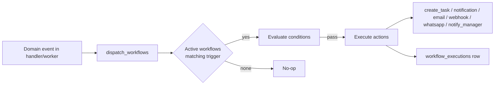

# Workflow Engine

Source of truth: `backend/src/workflow_logic.rs`  
Admin UI: `/admin/workflows` · API: `/api/admin/workflows`  
Module doc: [modules/workflows.md](modules/workflows.md)

Workflows are **event → (optional conditions) → actions**. Matching active workflows for the tenant run asynchronously; each run writes `workflow_executions` and bumps `workflows.execution_count`.

---

## Lifecycle

1. Domain code calls into `workflow_logic` with `trigger_type` + JSON context (`user_id`, dates, amounts, etc.).
2. Engine loads enabled workflows for `organization_id` whose trigger matches (including aliases).
3. Optional condition DSL filters runs.
4. Actions run in order; partial failures mark execution `partial` / `failed`.
5. Background worker (`jobs/workflow_events_worker.rs`) also emits **`task_overdue`** on a schedule.

---

## Triggers

| Trigger | Aliases | Fired from | Typical context |
|---------|---------|------------|-----------------|
| `leave_request_submitted` | `leave_submitted` | `handlers/leave_requests.rs` (create) | user, leave type, dates, days |
| `leave_request_approved` | `leave_approved` | `leave_requests.rs`, `manager.rs` | user, approver, dates |
| `leave_request_rejected` | `leave_rejected` | `leave_requests.rs`, `manager.rs` | user, reason |
| `attendance_clock_in` | — | `attendance.rs`, `biometric.rs` | user, date, source |
| `attendance_late` | — | same when late flag set | user, date, minutes late |
| `attendance_absent` | — | `attendance.rs` manual absent | user, date |
| `grocery_claim_submitted` | — | `grocery_benefits.rs` | user, claim id, amount |
| `asset_expense_submitted` | — | `assets.rs` | user, asset, amount |
| `doctor_report_published` | — | `doctor_reports.rs` | employee, report id |
| `user_created` | `user_joined` | `users.rs` | new user id, name, email |
| `payslip_generated` | — | `payroll.rs` | user, month, year, payslip id |
| `task_overdue` | — | `jobs/workflow_events_worker.rs` | task id, assignee |

Constants: `SUPPORTED_TRIGGER_TYPES` in `workflow_logic.rs`.

---

## Actions

| Action | Aliases | Effect |
|--------|---------|--------|
| `create_task` | `assign_to_user`, `task` | Inserts `tasks` row (todo / medium; optional due date / assignee from config or context) |
| `notification` | `send_notification`, `notify`, `log` | Inserts `org_notifications` for audience |
| `email` | `send_email` | SMTP via `tenant_email` when configured; often also creates an org notification |
| `webhook` | `webhook_post`, `http_webhook` | Async HTTP POST of event JSON |
| `whatsapp` | `send_whatsapp`, `whatsapp_message` | MSG91 WhatsApp to user mobile |
| `notify_manager` | `assign_manager_notification`, `escalate_to_manager` | Notification (and related notify path) to reporting manager |

Constants: `SUPPORTED_ACTION_TYPES`.

---

## Admin API

| Method | Path | Notes |
|--------|------|-------|
| GET / POST | `/api/admin/workflows` | List / create |
| GET / PUT / DELETE | `/api/admin/workflows/{id}` | CRUD |
| POST | `/api/admin/workflows/{id}/toggle` | Enable / disable |
| POST | `/api/admin/workflows/{id}/duplicate` | Clone definition |
| GET | `/api/admin/workflows/{id}/executions` | Run history (if exposed) |
| POST | `/api/admin/workflows/{id}/test` | Dry-run / test fire (if exposed) |

Permissions: `view-workflows`, `create-workflows`, `edit-workflows`, `delete-workflows`, `toggle-workflows`.

---

## Tables

| Table | Purpose |
|-------|---------|
| `workflows` | Name, trigger, conditions JSON, actions JSON, enabled, org, execution_count |
| `workflow_executions` | Status (`running` / `completed` / `partial` / `failed`), payload, timestamps |
| `tasks` | Created by `create_task` |
| `org_notifications` | Created by `notification` / email helpers |

---

## Example recipes

| Goal | Trigger | Actions |
|------|---------|---------|
| Late clock-in escalation | `attendance_late` | `notify_manager` + `create_task` |
| Leave submitted → HR task | `leave_request_submitted` | `create_task` assigned to HR role/user |
| New hire welcome | `user_created` | `email` + `notification` |
| Payslip ready | `payslip_generated` | `email` employee |
| Overdue task nudge | `task_overdue` | `whatsapp` / `notification` |
| Grocery claim review | `grocery_claim_submitted` | `create_task` for finance |

---

## Related

- [INTERCONNECTIONS.md](modules/INTERCONNECTIONS.md) — which modules emit events
- [tasks.md](modules/tasks.md) — task board consuming `create_task`
- [notifications.md](modules/notifications.md) — inbox for `notification` actions
- [settings.md](modules/settings.md) — SMTP / WhatsApp prerequisites
- Suite: `scripts/test-workflow-suite.py`
