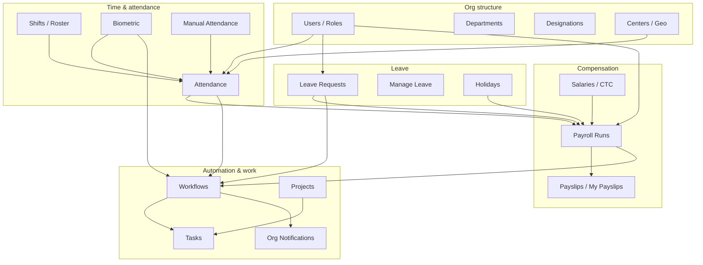

# Module Interconnections

How Raintech HRM domains feed each other. Plan keys and routes: [MODULES_OVERVIEW.md](../MODULES_OVERVIEW.md). Automation detail: [WORKFLOWS.md](../WORKFLOWS.md).

---

## System graph

---

## Relationship catalog

| From | To | How |
|------|----|-----|
| **Users / departments / designations / centers** | Almost all modules | `user_id`, `organization_id`, `department_id`, center / work_location |
| **Centers + geo_policy** | Attendance | Geofence on clock-in (`geo_policy.rs`, center lat/lng/radius) |
| **Shifts** (`shift_logic`) | Attendance | Expected in/out, late/early, scheduled working day |
| **Shifts** | Payroll | Working-day mask for LOP / present day counts |
| **Biometric** | Attendance | Device punches → attendance sessions; may fire `attendance_clock_in` / `attendance_late` |
| **Manual attendance** | Attendance | Same `attendance` table; can fire `attendance_absent` |
| **Leave (+ manage)** | Payroll | Approved leave / LOP weights via leave types & credits |
| **Holidays** | Payroll + reports | Paid holidays reduce LOP; register reports |
| **Attendance** | Payroll | Present / absent days in `payroll_logic.rs` |
| **Salaries / components / CTC** | Payroll | Gross, statutory bases, advances |
| **Payroll** | Payslips / my_payslips | Generated slips; can fire `payslip_generated` |
| **Payroll advanced** | Payslips | Variable pay, reimbursements, tax, bank file |
| **Workflows** | Tasks, notifications, email, WhatsApp, webhooks | See [WORKFLOWS.md](../WORKFLOWS.md) |
| **Projects** | Tasks | Optional `project_id` on tasks |
| **Careers** | Job applications | Public jobs + resume webhook |
| **Chat** | Users / departments | Space membership; dept channels |
| **Assets** | Users | Allocations; expense submit → workflow |
| **Grocery** | Users | Claims → workflow |
| **Doctor reports** | Users | Employee + doctor; publish → email + workflow |
| **Reports** | Attendance, leave, payroll | Read-only aggregates |
| **Subscription / plan_limits** | Entire sidebar | Module entitlement + RBAC slugs |
| **Settings** | Leave types, SMTP, logos, webhooks | Config consumed org-wide |
| **Manager APIs** | Attendance + leave | Scoped to reporting line |
| **Platform** | Organizations / plans / overrides | Gates tenant modules |
| **Tenant support** | Platform support | Tickets & KB |
| **Tenant billing** | Platform billing | Upgrade requests / invoices |
| **Files / storage / S3** | Chat, doctor Rx, logos, desktop | Shared object store |

---

## End-to-end process flows

### 1. Clock-in → payroll LOP

1. Employee clocks in (app / biometric / manual).
2. `shift_logic` resolves shift (roster → assignment → default).
3. Late / early / duration flags stored on `attendance`.
4. Month-end payroll loads attendance + leave + holidays + salary.
5. `payroll_logic` computes working days, LOP, OT, net → payslip.

### 2. Leave request → approval → payroll

1. Employee submits leave (`leave`).
2. Workflow may create HR task / notify manager.
3. Approver acts via `leave_manage` or manager team leave.
4. Credits adjust; approved days affect payroll LOP / paid leave.

### 3. Hire → access

1. Admin creates user (`users`) or ATS hires via careers/applications.
2. Roles + plan modules determine permissions.
3. `user_created` workflow can email / notify / create onboarding tasks.
4. Assign shift, department, center for attendance eligibility.

### 4. Device punch path

1. Device hits `:7788` iClock / BIO-PARK TCP.
2. Punch stored; PIN map resolves `user_id`.
3. Background / sync path opens/closes attendance.
4. Tenant biometric UI lists punches scoped to org devices.

### 5. Automation fan-out

Any supported trigger → workflows → tasks / org notifications / email / WhatsApp / external webhook (`tenant_webhooks` or action webhook).

---

## Code map (logic crates)

| Concern | Primary files |
|---------|----------------|
| Shift resolution | `backend/src/shift_logic.rs` |
| Attendance sessions | `backend/src/attendance_logic.rs`, `handlers/attendance.rs` |
| Payroll math | `backend/src/payroll_logic.rs`, `handlers/payroll.rs` |
| Geofence | `backend/src/geo_policy.rs` |
| Workflows | `backend/src/workflow_logic.rs` |
| Plan gating | `backend/src/plan_limits.rs` |
| Routes | `backend/src/routes.rs` |
| Sidebar | `frontend/src/lib/admin-nav.ts` |

---

## Charts / topology

Broader topology diagrams also live in [PROJECT-WORKFLOW-CHART.md](../PROJECT-WORKFLOW-CHART.md).
